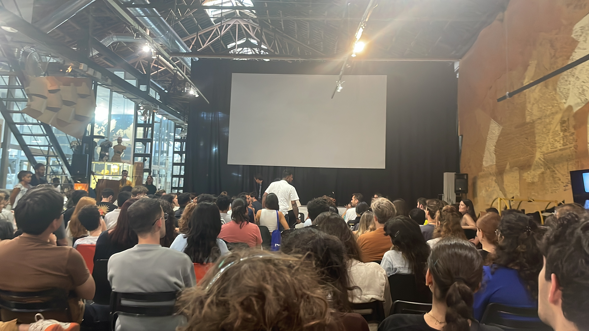

## Master in Design for Emergent Futures

Hello there!
This is Jorge De la Mora, I'm studying the Master of Design for Emergent Futures at IAAC + Elisava, class of 2023-24.

I'm a multi-disciplinary designer, with previous work in **Industrial design, Innovation, Human Centered Design, and Strategic Foresight**, I've also dabbled in Mobility design, Systemic thinking, Generative design, and Immersive design.

I'm looking forward to learn IAAC's approach to futures and to be able to execute this into high level design that have a purpose for our journey to preferable futures 🖖

<iframe width="560" height="315" src="https://www.youtube.com/embed/nsv7OzujbLE?si=mRrAP9qVLJ6nG2Cv" title="YouTube video player" frameborder="0" allow="accelerometer; autoplay; clipboard-write; encrypted-media; gyroscope; picture-in-picture; web-share" allowfullscreen></iframe>
