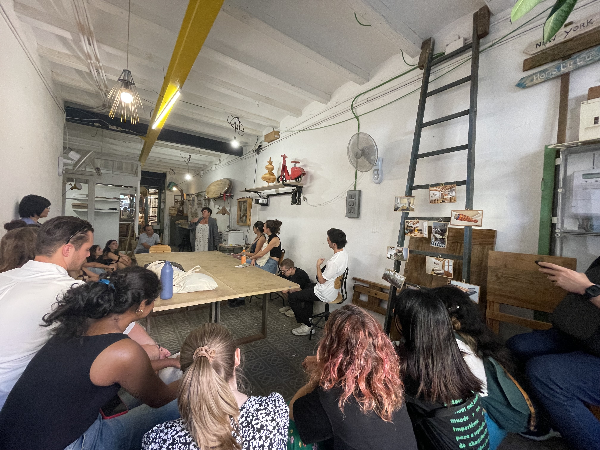

---
hide:
    - toc
---

# Landing

Last week, we embarked on the Masters for Design in Emergent Futures, and it was nothing short of exhilarating. During "Landing Week", it set the tone for what's to come, blending a unique mix of familiarization and intensive learning. Right off the bat, my classmates stood out – a diverse group of enthusiastic individuals from varied backgrounds, each bringing a unique perspective to the table.

Our educators wasted no time diving deep. Philosophy sessions stirred introspection and first-person research emphasized the essence of experiential narrative in design. The technical side wasn't neglected; grappling with Git sessions and mastering the art of documenting design marked the week. One week in, and it's evident – this journey will challenge conventions and redefine our horizons. Engage!

