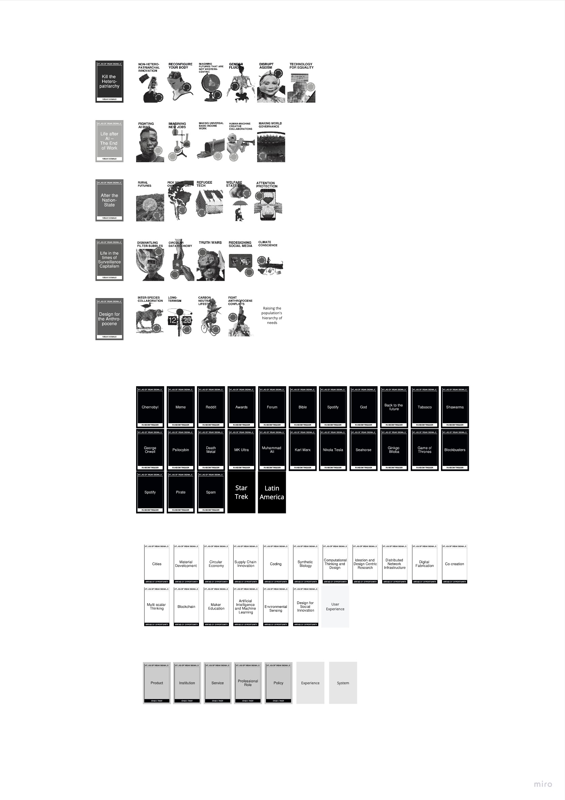
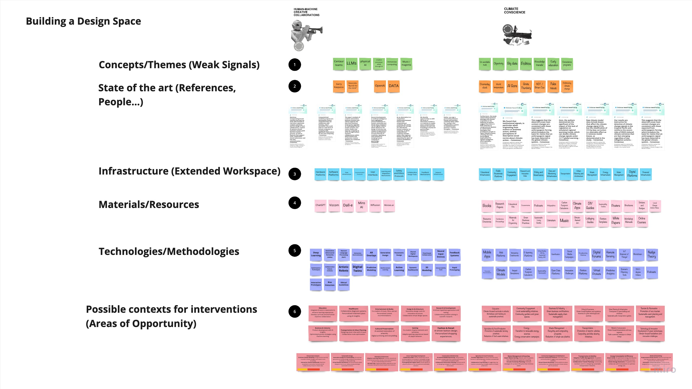
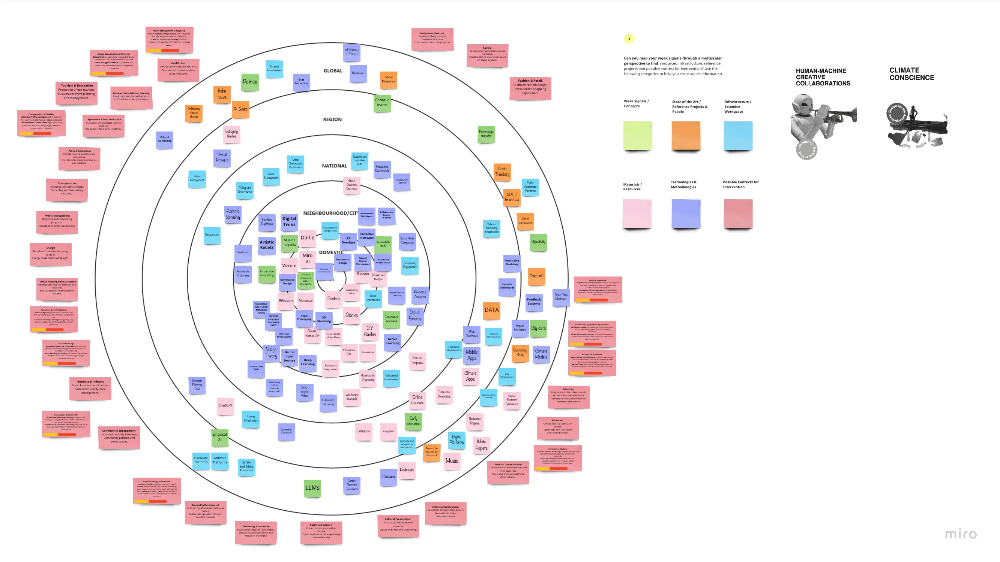
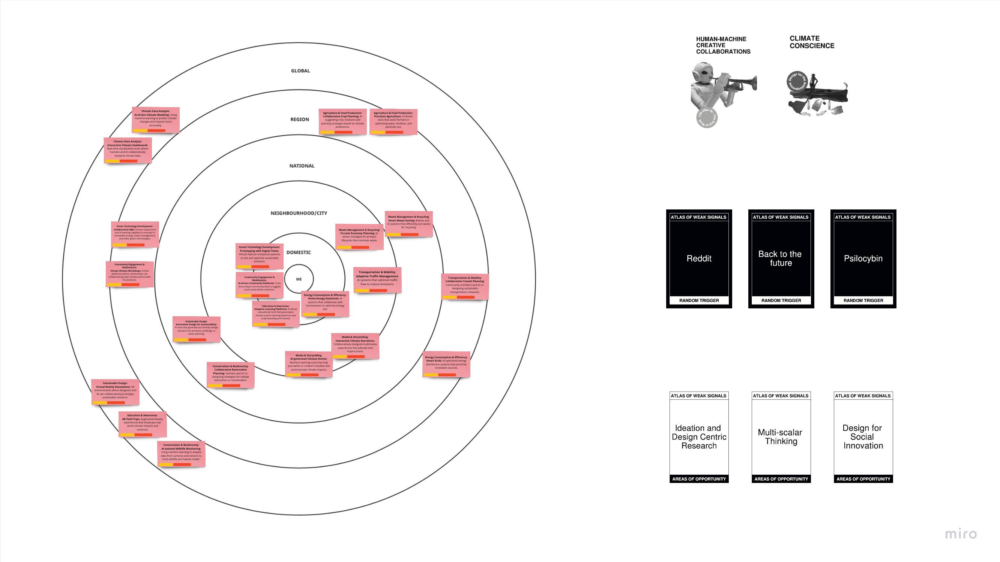
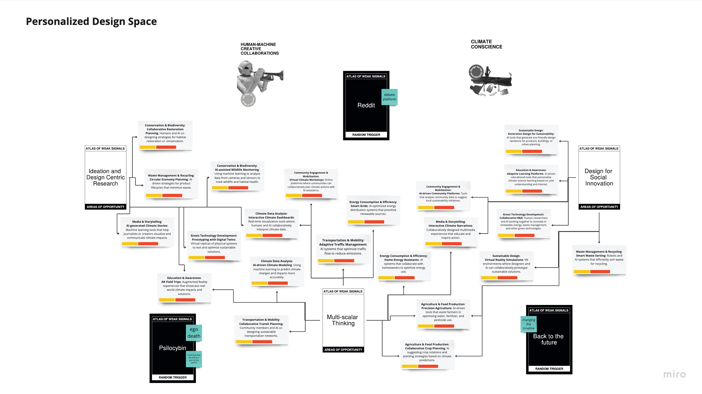

---
hide:
    - toc
---

# Atlas of Weak Signals

During our Atlas of weak signals activities, we've been working through some exercises that promote the correlation of ideas, and of course, deep conversations among the class about the world, the realities that we all live through, and the implications of changes that the cards on the AoWS suggest.

## You can check my excercise in Miro here:

<iframe width="768" height="432" src="https://miro.com/app/live-embed/uXjVNcVo8gg=/?moveToViewport=57443,24626,7702,5222&embedId=358883566221" frameborder="0" scrolling="no" allow="fullscreen; clipboard-read; clipboard-write" allowfullscreen></iframe>

## Atlas of Weak Signals Deck

Atlas of weak signals deck.

## Class excercise
For this excercise, my team and I drew **Carbon Neutral Lifestyle** & **Refugee Tech**.
With the random triggers **Microbiotic Literacy** & **Neighborhood FabLabs**.
And the Areas of opportunity being **Supply Chain Innovation** & **Circular Economy**.

As you can see on the picture, the conversation was very interesting, touching on topics of access, results, and changes in the way people consume things. 
Here's where my idea for the Hierarchy of needs that I added later came from.

## Full Deck Spread and my additions

Here you can see how the full deck looks when open, I've added a couple of cards to each category:
| Title                    | Description                                                                                                                                                                   |
|---------------------------|-------------------------------------------------------------------------------------------------------------------------------------------------------------------------------|
| Designing for the Anthropocene | Raising the population's hierarchy of needs. Using Abraham Maslow's hierarchy, we can envision societal evolution if basic needs are increasingly met.              |
| Random Triggers           | - Star Trek: Envisioning a post-scarcity society for ideation beyond collapse-based scenarios. - Latin America: Focusing on this region may yield unique scenario insights. |
| Areas of Opportunity      | User Experience: Central to identifying opportunities; a critical lens for scenario analysis.                                                                                  |
| Challenge                 | - System: Consider systems for mapping paths to preferable scenarios. - Experience: Central to the challenge, necessitating a focus on user interaction.                    |

## Initial Design Space
**Human Machine Creative Collaboration + Climate Conscience**

**Reddit + Back to the future + Psilocybin**

**Ideation and Design Centric Reseach + Multi-Scalar Thinking + Design for Social Innovation**

## Building a Design Space
Here I went a bit crazy with references for each of the main subjects, including links to scientific papers to actually get some signals.
I'm pretty satisfied with the available information for this.

## Multi-scalar Design Space
Here I placed my references in the Multi-scalar framework, being careful to also think about the impact that these ideas might have in possible resulting scenarios.

## Mixed Atlas of Weak Signals
Using both main signals, I concluded several possible avenues for research and continued ideation in hopes of creating positive scenarios for Human-machine creative collaboration FOR Climate Conscience.

## Personalized Design Space
This is how my design space looks with the possible avenues for these subjects. I believe the interconnectedness of the subjects we are talking about might produce some very interesting results for projects during this master's. (even though there are many more categories I'd love to explore)

