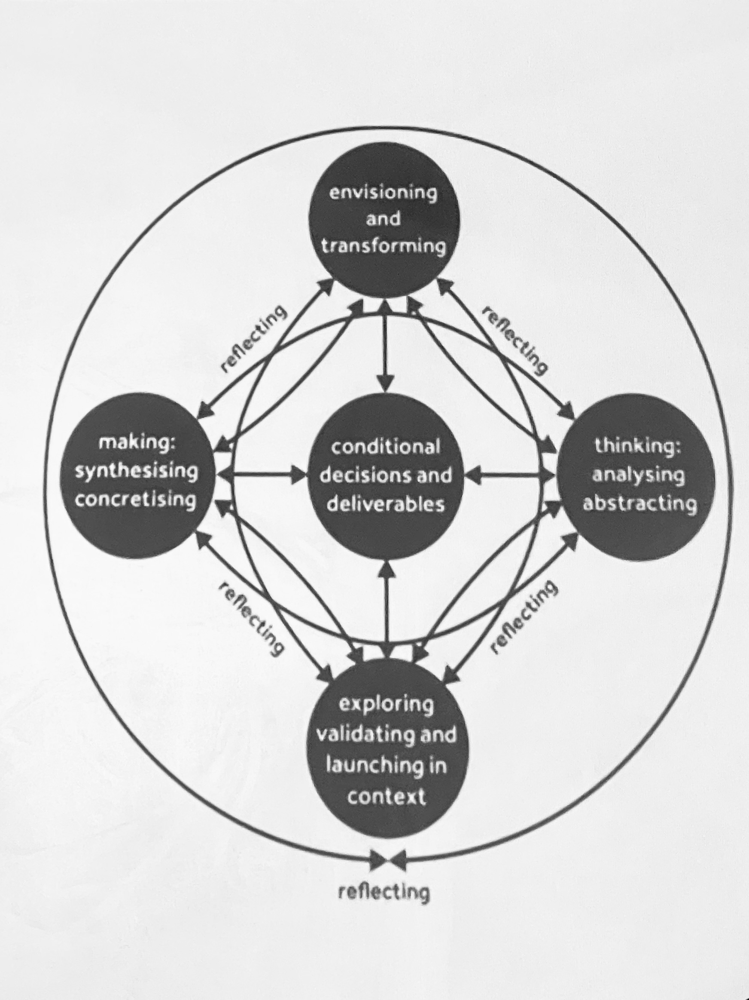
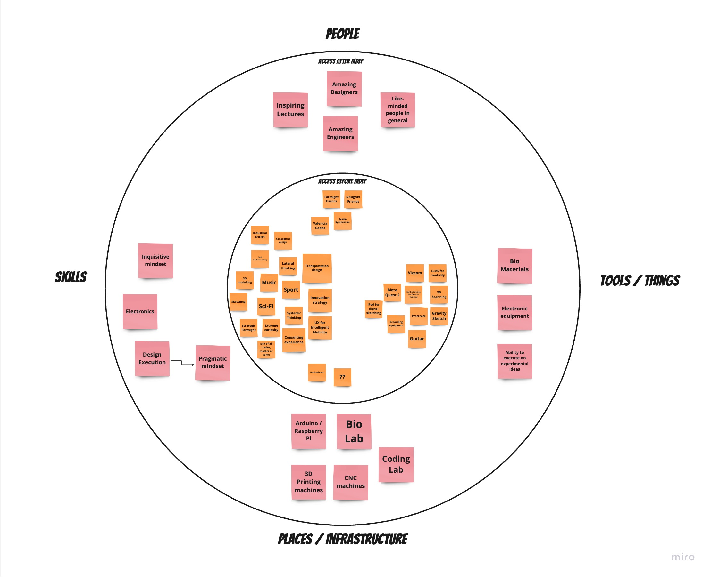
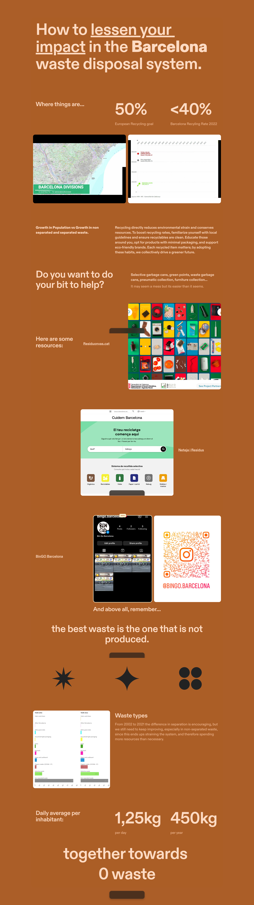

---
hide:
    - toc
---

# Design Studio

As for design studio, we're diving deep into prototyping, it's roles, and first person research. 

## Prototyping excercise

For one of our first exercises, we shared past projects with our group, and exchanged them to re-think them with a new perspective.
My fellow student Ever, talked about a project in his architecture degree, where they proposed the famously exclusive University to open a new passageway through a wall that leads to a barrio that usually houses foreign students, and they prefer walking since they are very close.
Problem is, this university is extremely car-centric in it's approach to entrances and exits, and since these entrances are only for people associated with the university, anyone wanting walk through it cannot, and instead has to walk around the university.

So in my re-imagined design project, the new gate has a very chaotic, and frankly dystopic solution for non-university related people to be able to go through: to be enveloped in a human sized plastic bubble, so they can walk across campus, and only be able to leave the bubble, once they cross to the other side. 
To be fair (....) this is obviously a very exaggerated solution, but I find it would really emphasize the university's policies of only letting alumni and related people inside, unlike universities in Europe, for example.

## Reflection
I think this was a very interesting excercise since we were allowed to create more 'Critical Design' type solutions to other people's projects, which is why I allowed myself to create such aggressive and frankly crazy solution for Everardo's University project. 

## Personal RtD Toolbox

I've downloaded some of my Skills, Tools, People, and places to this RtD Toolbox, but I figured I'll keep updating it as the course keeps going, since I feel like I'm learning so much, including how to finally connect some diverging learning streaks I've made in various subjects into a more tangible project.

## Shared Design Space and Design Intervention

This project has been very intense since it's been running in parallel to other projects.
Our initial ambitions were demolished as time passed, but we ended up learning some really valuable information that with maybe a bit more time we will be able to understand and help shape our future strategy regarding waste disposal systems.

Initially our ideas revolved around getting interesting data from waste disposal companies, maybe even data that they were not collecting themselves, our idea revolving around identifying where in the city waste was being separated properly with the goal of reducing strain in the "circularity" of Barcelona.

After our visit at Urbaser, where we were given a great chat about the current effort that they are making, and some interesting insights into the current system of waste disposal of the city, we were also given the privilege of visiting the green roof of their building, which was an amazing experience, and expecially coming from the man himself, Joan Bosch, who was granted 100k euro from the government to fund the exploration of this very interesting idea for wellbeing and temperature management.

In the end, we learned that much of what we thought would be possible, was either already being tested, or simply unfeasable for our timeframe, so we decided to refocus our intervention between two ways of affecting the current system: *1. To better understand and 2. To better educate*

Since our intention is to make a ding in the current way of doing things we have to acknowledge the variables that make it what it is, in this case, we learned that 59% of the waste disposed is thrown in the 'resta' bin, meaning more than half the waste thrown away was not separated properly.

We decided to intervene this system, by learning of what is being done already, and the behavioral nudge that is being implemented falls on the premise that anonymity means people will not care to separate waste properly, but in my personal opinion, having to look over every person disposing of waste is maybe not the best long term solution, so we decided education and public participation was the goal, meaning we would have to find a way to Educate our fellow citizens so they understand why they must try to separate their waste better, instead of imposing more rules to do it.

Our final solution is to have an always evolving set of informational outlets to keep the public updated on the best way to reduce their impact in the circularity of the city, this set consists of an [Instagram page called BinGo](www.instagram.com/Bingo.Barcelona), where we explain which bin to use for different types of waste in four different languages, aswell as an [infographic focused data outlet](https://tome.app/jdlm-24d/barcelonas-waste-management-system-clom2go2g0ulqmy7cbr94ra6x) where we periodically inform the citizens of Barcelona of the current best way to be informed about the circular system.

Here's the video with the reels we posted on the social network, plus a few bonus scenes:

https://youtu.be/fhhr1BJ_tmA?feature=shared

(original music by yours truly 😎)

