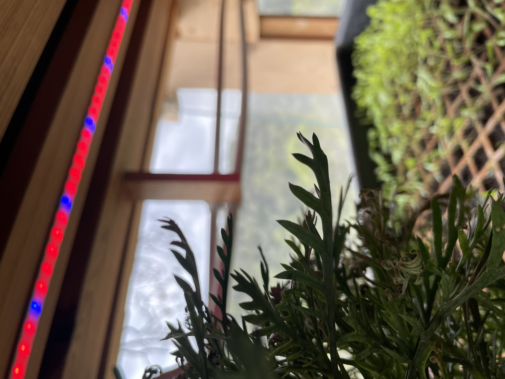
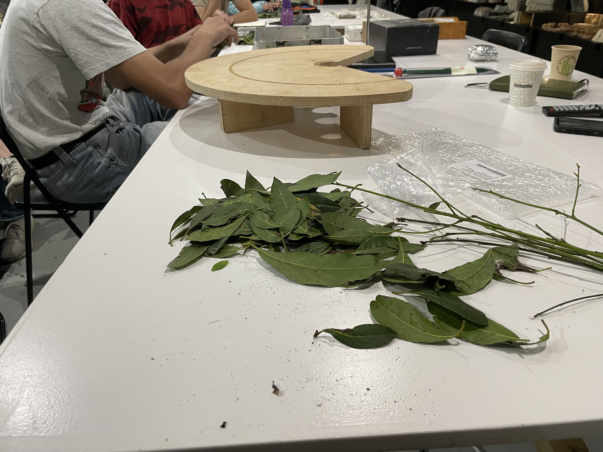

---
hide:
    - toc
---

# Agri Zero

On the other hand, the Agri Zero course with Jonathan Minchin was an experience from the get go, starting with the walk and visit to Valldaura labs, where we used iNaturalist to identify insects and plants, identifying ecotone changes, helped moved a lot of dirt to start a new garden, among other very fun activities.

Then back at IAAC, the re-introduction to the world of plants and mushrooms served as a very inspirational talk to understand and reflect on the huge possibilities of potential projects we could undertake through this route.

The soil classification aspect to it was something I really took to, even going as far as to design a GPT bot that helps users classify their soil properties from pictures, and understand what they could plant on it. 
We also made Laurel essential oil, which was super fun to work on!

