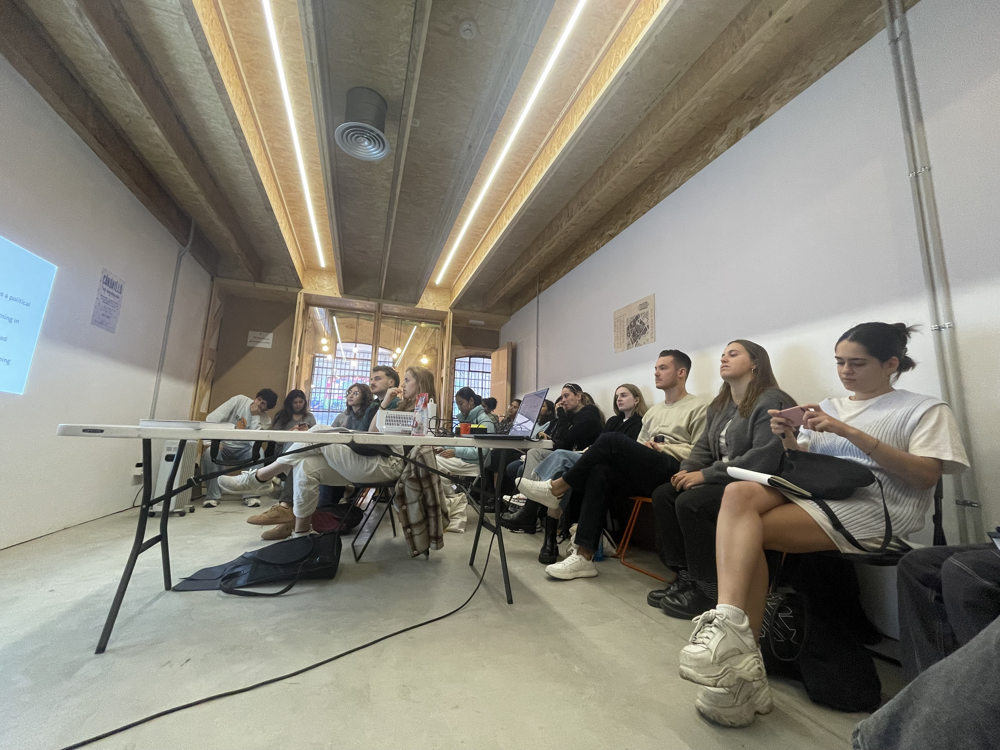
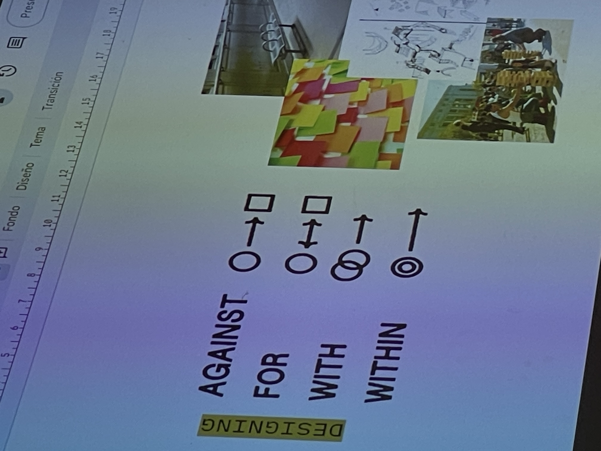
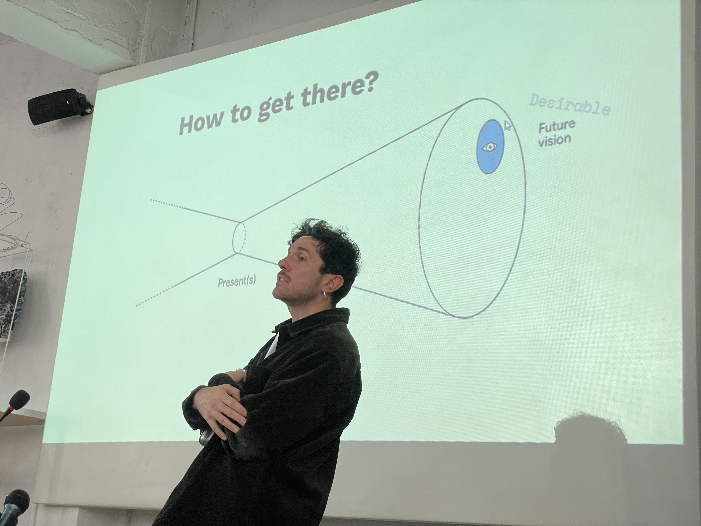
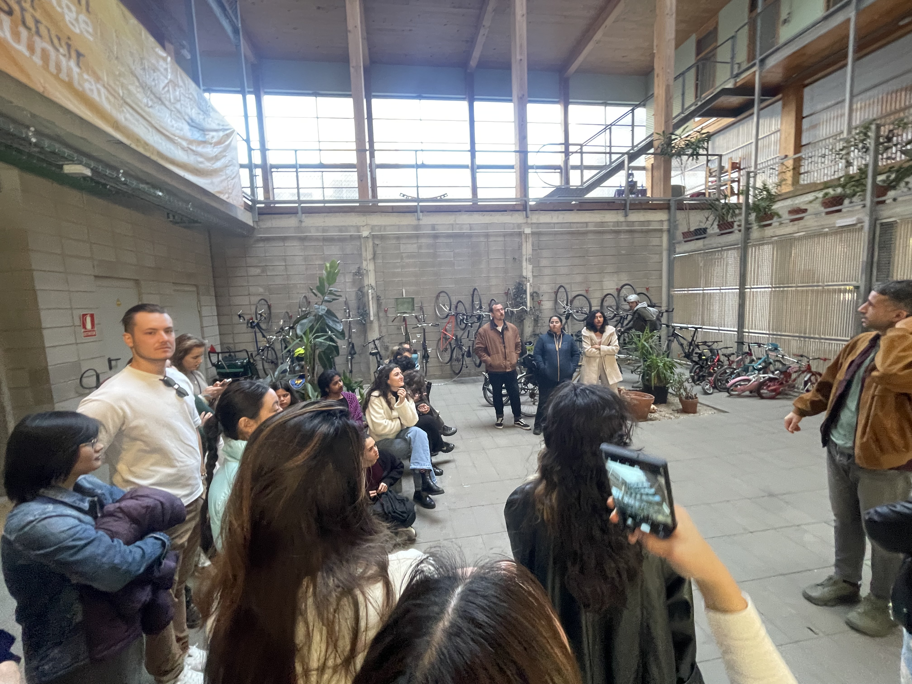
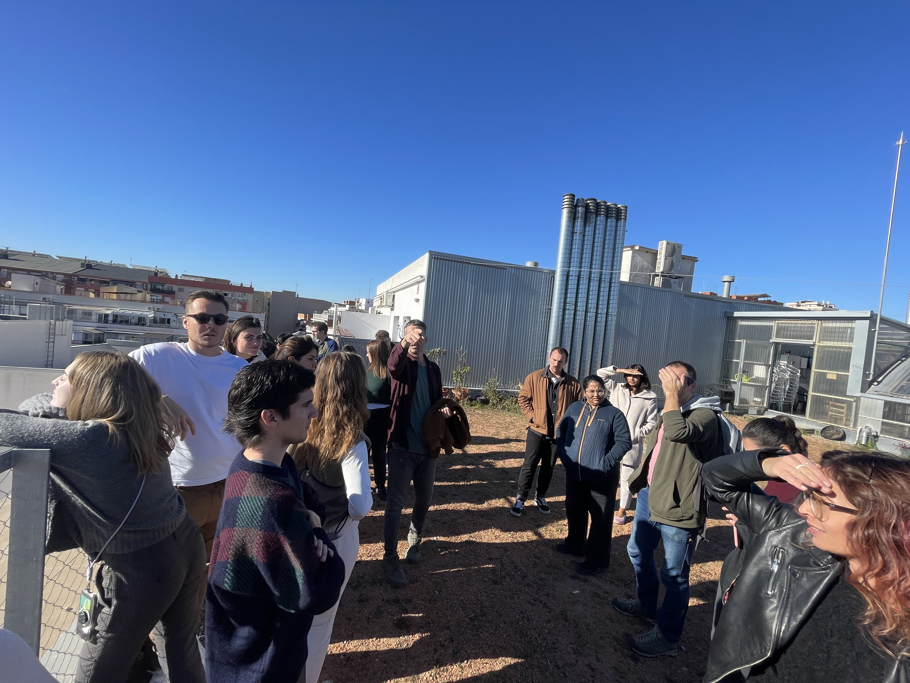
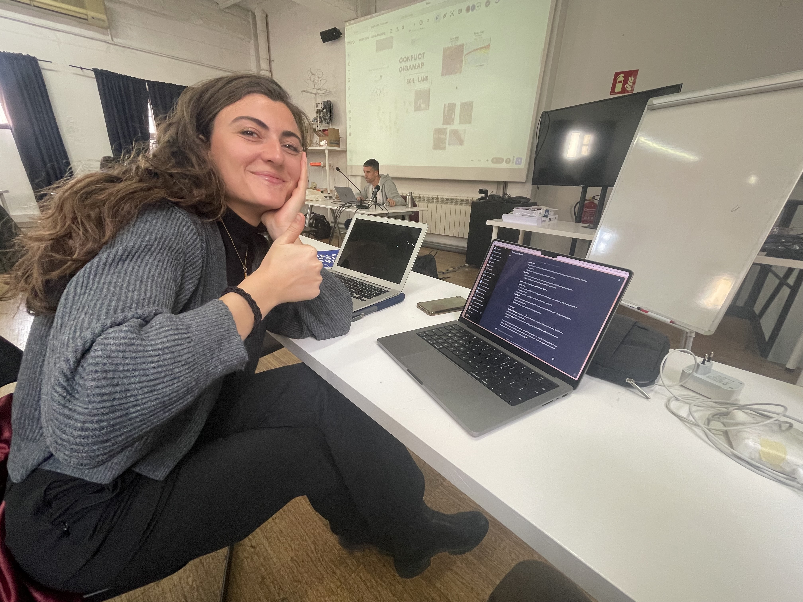

---
hide:
    - toc
---

# Designing With Others

Participating in the "Design with Others" sessions was an eye-opening experience that expanded my understanding of community and design. The course's approach to viewing community broadly, including not just people but also ideas and concepts, was enlightening. Learning about the food system's transformation potential and the importance of considering local and seasonal aspects made me realize the impact of design decisions on sustainability.

Understanding soil as a common resource and the sociotechnical aspects of urban land was particularly intriguing. It challenged me to think about the complex relationships between humans and their environment. The discussions about designing in complex contexts and the need for a humble approach in design resonated with me. It emphasized the importance of being aware of the political implications and the deep timescales involved in transformative changes.

The course's emphasis on the interconnectedness of things and the frameworks provided for understanding and navigating complex systems were valuable takeaways. Creating a bot to help communities structure themselves effectively was a practical application of the course's concepts, demonstrating how design can directly contribute to community building and sustainability. Overall, the sessions were a profound learning experience that has shaped my perspective on design and its role in addressing societal challenges.

## Intervention: Community Builder

### The task

During the course of the class, my teammates, Jorge, Sophie, and Myself had ideas around communities and the process to become organizations that can be more efficient in achieving their goals, even from the ground up.
We began by identifying the common challenges faced by both new and established communities. For new communities, the challenges are often about establishing a clear structure and vision, while established communities might struggle with adapting to change, resolving conflicts, or maintaining active engagement.

A key decision in the development of Community Builder was to base it on sociocracy principles. Sociocracy, known for its emphasis on equality in decision-making, was chosen for its democratic and inclusive approach, ensuring that every member of a community has a voice.

Another crucial component of Community Builder is its one-question-at-a-time assessment process. This was designed to gather essential information about a community, such as member count, existing structures, and specific challenges, in a way that is not overwhelming and allows for thoughtful responses.
The tool was designed to not only assess but also provide actionable guidance. This includes recommendations for organizational structures, action plans for implementing changes, feedback mechanisms, and conflict resolution strategies.
Recognizing the importance of clarity, the tool was designed to visually represent community structures and feedback mechanisms in a way that could be easily understood and implemented.

The ultimate goal of Community Builder is to empower communities to enact change. Whether it's a new community laying its foundation or an established one seeking revitalization, the tool is meant to guide them towards a more democratic, inclusive, and sustainable future.

### The solution:

Welcome to Community Builder, the innovative solution designed to transform the way communities operate and interact. At its core, Community Builder is a specialized tool that integrates the principles of sociocracy to guide both new and existing communities in creating more democratic, inclusive, and efficient governance structures. Whether you're looking to establish a new community or enhance the dynamics of an existing one, Community Builder offers a unique blend of assessment, planning, and implementation strategies.

With a focus on participatory decision-making and equitable involvement, Community Builder enables communities to thrive through improved communication, effective conflict resolution, and adaptive governance models. By tailoring its approach to each community's specific needs, Community Builder ensures that every member's voice is heard and valued, fostering a sense of belonging and shared purpose. This tool is more than just a platform; it's a pathway to building harmonious, resilient, and sustainable communities for the future.

<iframe width="560" height="315" src="https://www.youtube.com/embed/ZRxloGu2c5E?si=JehF4zpWobunX6jS" title="YouTube video player" frameborder="0" allow="accelerometer; autoplay; clipboard-write; encrypted-media; gyroscope; picture-in-picture; web-share" allowfullscreen></iframe>

If you'd like to test Community Builder, contact me.