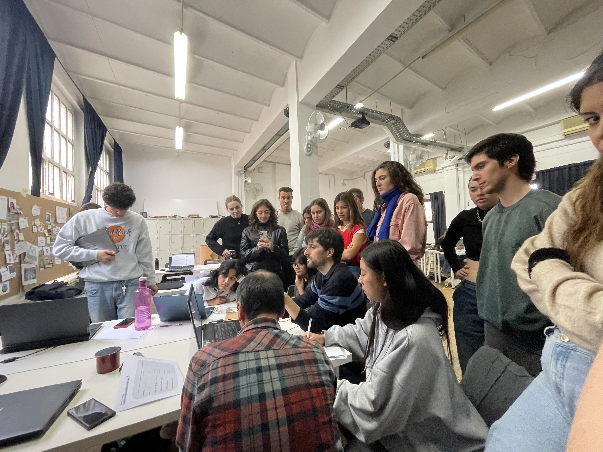
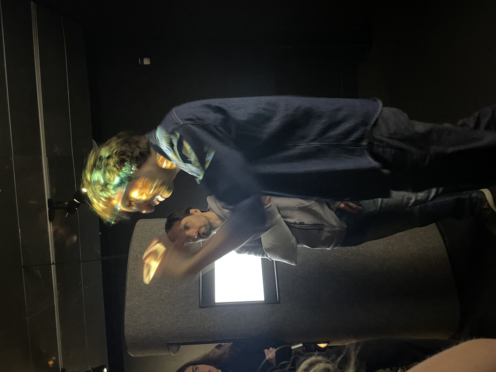
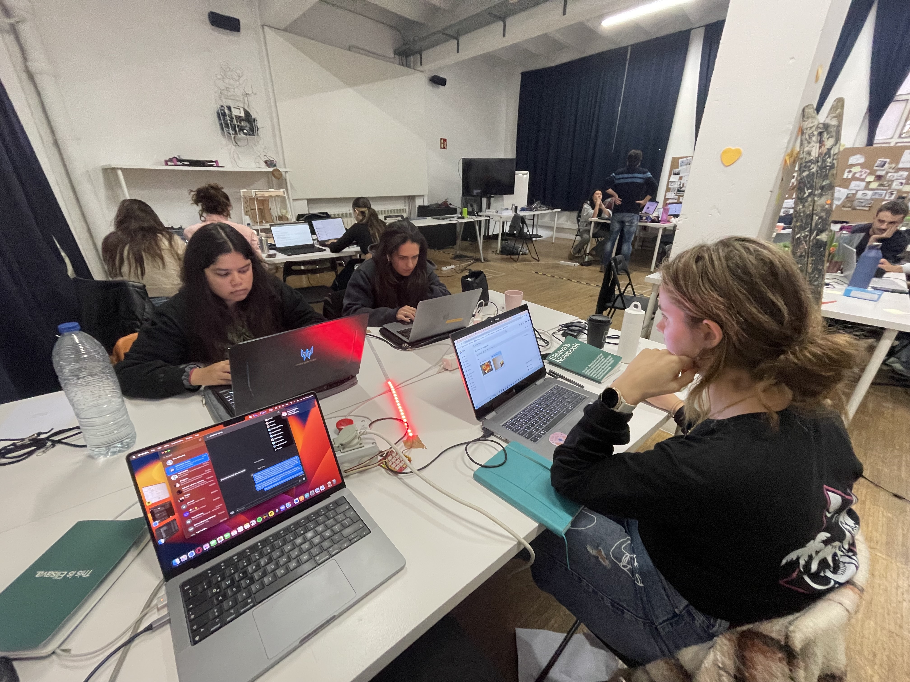
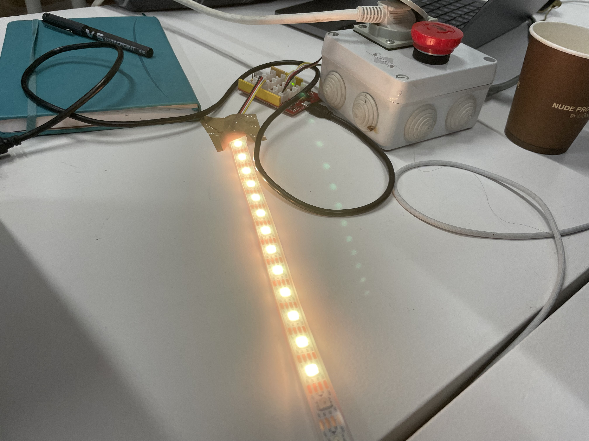

---
hide:
    - toc
---

# Extended Intelligences

Reflecting on the Extended Intelligences course, it's like we've been on a wild ride through the AI landscape, and let me tell you, it’s been nothing short of a brain workout. From the get-go with Pau Artigas at the helm, we didn’t just skim the surface of AI; we dove headfirst into its deep and murky waters.

Day 2 was all about getting our heads around the tech side of things. We delved into neural networks, datasets, training, and models. It was like piecing together a complex jigsaw puzzle, with each part – neural networks with their self-configuration mojo, diverse datasets, the nitty-gritty of training, and the final model – coming together to form a complete picture. It’s fascinating how these networks configure themselves based on examples, and how the type of data they work with (be it images, text, or sound) shapes their learning.

Then, Day 3 had us exploring the enigmatic world of Latent Spaces. Imagine a realm where data points are not just data points, but multi-dimensional representations capturing the essence of the data. It’s like stepping into a parallel universe where everything you thought you knew about data gets a whole new meaning.

What really got me thinking was the exercise on datasets. It was an eye-opener, making us critically analyze and choose datasets that resonated with us for various reasons – be it their utility, curiosity, or the potential issues they presented. It pushed us to think beyond the usual and consider the impact of the data we feed into these AI systems.

Throughout the course, we kept circling back to the foundational models, grounding our understanding in the solid bedrock of AI concepts. It’s like having a trusty map while navigating the often-confusing terrain of AI technologies.

In all of this, the ethical and social implications of AI were never far from our minds. It was like having a moral compass guiding us through our journey, ensuring we didn’t lose sight of the bigger picture – the impact of AI on society and our responsibility towards it.

As we wrapped up the course, it was clear that our understanding of AI had evolved. It wasn’t just about the technology anymore; it was about seeing AI as a tool for change, a medium for creative expression, and a subject of critical analysis. It’s like we’ve been equipped with a new lens to view the world, one where AI plays a crucial, yet complex, role.

All in all, the Extended Intelligences course has been an enlightening journey, melding technical skills with critical thinking and a deep understanding of the ethical dimensions of AI. It's not just a course; it’s a whole new perspective on what AI is and what it could be.

## Intervention

Jumping back into the mindset of the "Living with Your Own Ideas" course through this project was like revisiting an old friend with new stories to share. The project amplified my belief that shaping individual behaviors hinges on fostering a sense of community and collective action. It was never about penalizing ourselves; instead, we aimed to reframe our daily habits in a positive light. Visualizing energy consumption as euros tucked away, considering each commute as a step towards a greener planet, and comparing our food waste to that of an average person, made the whole process less of a chore and more of a rewarding game.

Bringing our little device to class added a new dimension to our project. It wasn't just a gadget; it was a conversation starter. As we unpacked its purpose - to monitor our daily energy consumption - our classmates' intrigue turned into a real-time reflection on our collective habits. This sparked discussions about sustainability in a way that was both engaging and eye-opening. This experience underlined a crucial learning for me: positive framing in environmental conservation can lead to more impactful and motivating discussions. Furthermore, embarking on this journey as a team not only heightened our collective responsibility but also highlighted the need for easier, more automated ways to track and maintain these eco-friendly habits in our busy lives.

The video:
<iframe width="560" height="315" src="https://www.youtube.com/embed/P_xzusilHT4?si=eZj5kXWhBWS-Ultx" title="YouTube video player" frameborder="0" allow="accelerometer; autoplay; clipboard-write; encrypted-media; gyroscope; picture-in-picture; web-share" allowfullscreen></iframe>

### Our AI Solution:

First off, we had to figure out how to get the input image from the user and pinpoint the food waste in it. It was like teaching the system to see through our eyes and understand our intention. Then came the real brain teaser - taking those identified ingredients and scouring for the most fitting repurpose method. It was a deep dive into a sea of possibilities, each more intriguing than the last.

The third step was where the magic happened. We aimed to create a generated image that visually represented the repurposing method. This wasn't just about coding; it was about infusing creativity into technology, making the AI not just a tool but an artist in its own right.

The final step was about bringing it all together. We wanted to present the user with a tangible output – a printed card that displayed both the image and the suggested reuse method. It was like crafting a story from data, a narrative that spoke of potential and sustainability.

As we embarked on the journey to bring this AI to life, the hunt for the right APIs was crucial. It was a process of discovery, tweaking them to fit our unique context. Writing the code to animate this AI felt like breathing life into our vision, turning abstract ideas into a reality that could potentially make a meaningful impact.