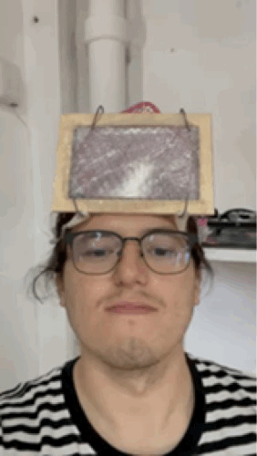

---
hide:
    - toc
---

# Designing With Others

Participating in the "Design with Others" sessions was an eye-opening experience that expanded my understanding of community and design. The course's approach to viewing community broadly, including not just people but also ideas and concepts, was enlightening. Learning about the food system's transformation potential and the importance of considering local and seasonal aspects made me realize the impact of design decisions on sustainability.

Understanding soil as a common resource and the sociotechnical aspects of urban land was particularly intriguing. It challenged me to think about the complex relationships between humans and their environment. The discussions about designing in complex contexts and the need for a humble approach in design resonated with me. It emphasized the importance of being aware of the political implications and the deep timescales involved in transformative changes.

The course's emphasis on the interconnectedness of things and the frameworks provided for understanding and navigating complex systems were valuable takeaways. Creating a bot to help communities structure themselves effectively was a practical application of the course's concepts, demonstrating how design can directly contribute to community building and sustainability. Overall, the sessions were a profound learning experience that has shaped my perspective on design and its role in addressing societal challenges.

