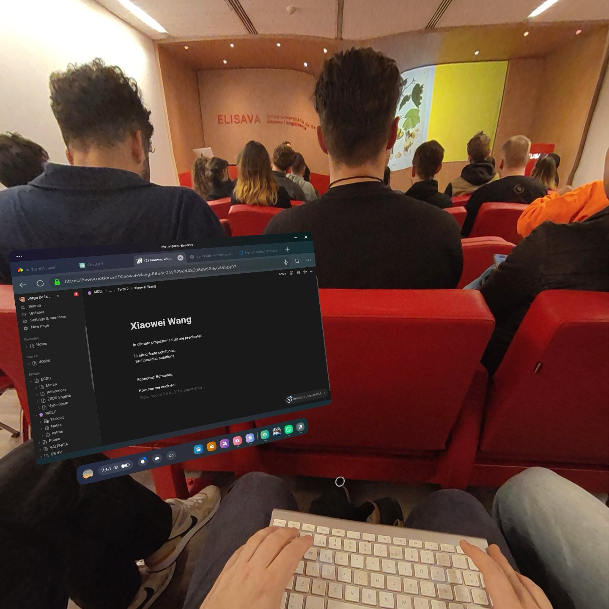

---
hide:
    - toc
---

## Introduction

Reflecting on my first intervention with immersive technology in public, specifically during the Critical Design podcast recording at Elisava, I realized how deeply this experience resonated with my situated epistemology. The act of donning the Meta Quest 3 in a public setting, especially on a day buzzing with reviews of its competitor, the Apple Vision Pro, marked a deliberate exploration into the unknown, guided by fundamental design principles.

### The Minimalist Approach

The decision to bring only the headset, its controllers, and a Bluetooth keyboard underscored my commitment to exploring the boundaries of immersive technology. This minimalist setup challenged conventional norms around productivity tools and emphasized the potential of immersive technology to enhance daily life beyond familiar environments.

### Experiencing Immersive Tech Publicly

The initial awkwardness of setting up a virtual workspace in a public forum underscored the importance of empathy in design. Despite the odd looks and increased self-awareness due to the noisy keyboard, this experience provided unique insights into integrating immersive technology into our daily routines, not as a distraction but as a means to augment engagement and productivity.

### Reflective Practices in Design

This experiment was a testament to the power of self-reflexive practices in the design process. It forced me to confront my biases and assumptions about public perception and the social acceptability of immersive tech. The intervention reminded me that designing for the unknown requires immersing oneself in uncomfortable situations to glean valuable insights and incorporate those learnings into a broader vision for the future.

### Impact on Future Immersive Experiences

The intervention has profoundly impacted my approach to developing future immersive experiences. It deepened my understanding of the user's experience in non-traditional settings and highlighted the challenges and opportunities of using immersive technology in everyday life. This aligns with my belief in the necessity of a reflective and transformative design process that is infused with core principles and allows for a personal vision to emerge, attuned to the nuanced dynamics of technology, society, and individual experience.

### Conclusion

In essence, this intervention served as a practical application of my situated epistemology, reinforcing my commitment to designing immersive experiences that are not only technologically advanced but also deeply human-centered, accessible, and inclusive. It was a powerful reminder that innovative design lies in embracing vulnerabilities, engaging with the world, and continually reflecting on our position within it.

