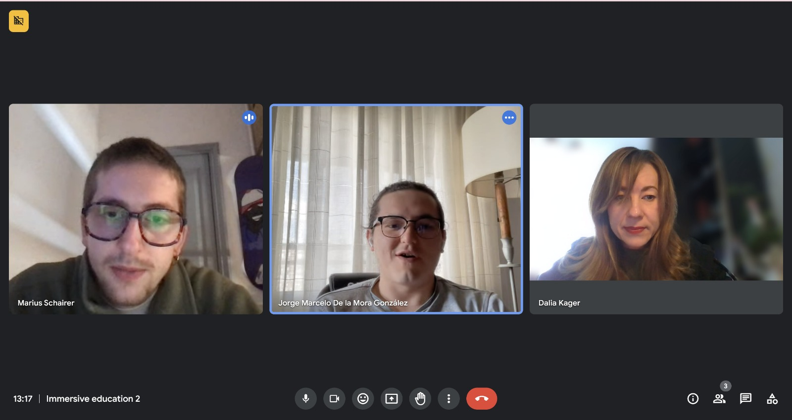
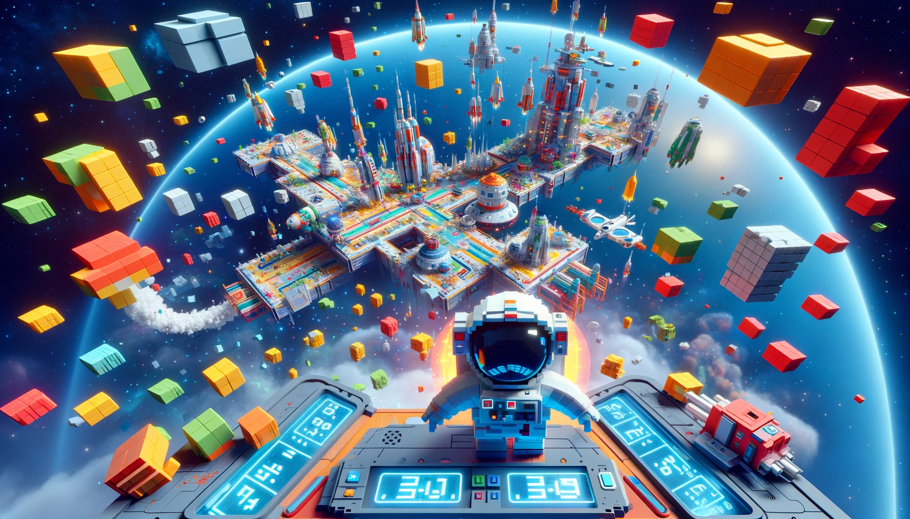
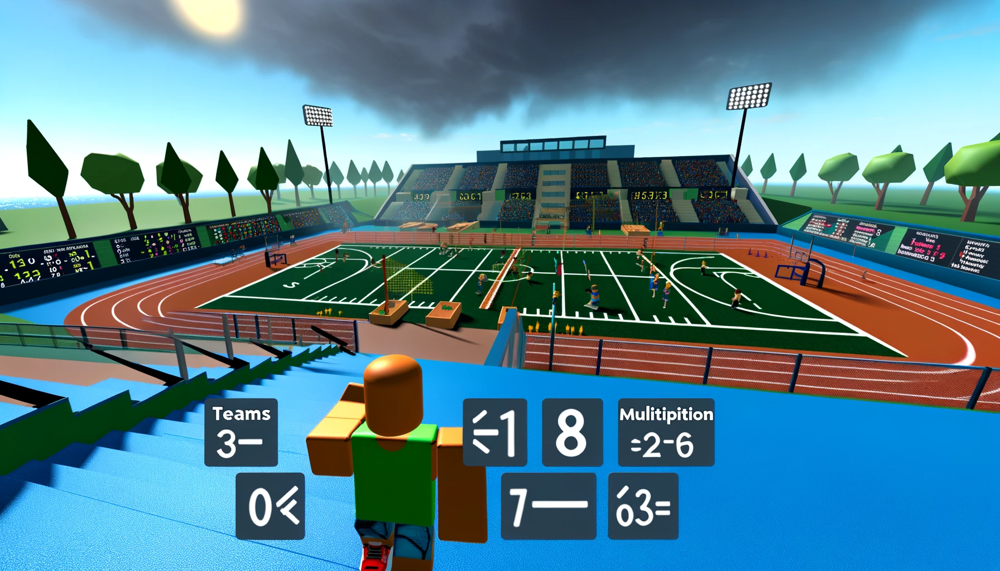
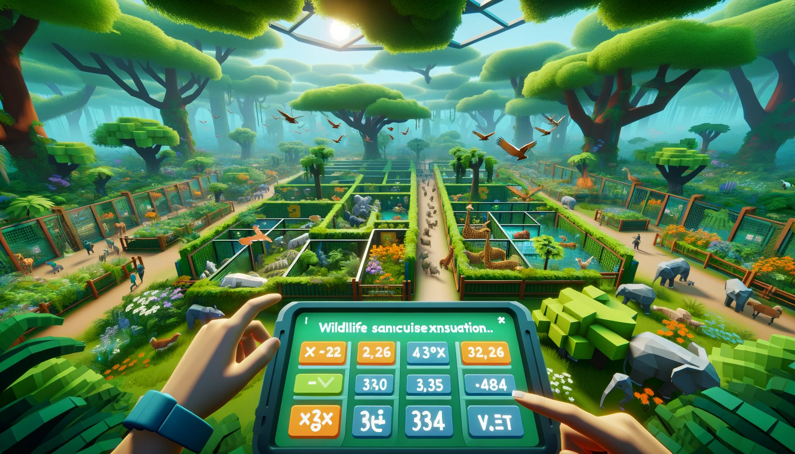

---
hide:
    - toc
---

# Intervention 2: Archetypes and Immersive design

Reflecting on this intervention, it feels like peeling back layers of innovation, pedagogy, and design thinking. This project is part of mine and my teammate Marius' aspiration to transcend traditional educational paradigms in all ages, introducing a multidimensional, immersive learning landscape tailored to the nuanced spectrum of, in this case, young learners' interests and inclinations. Here's a deeper dive into our process, philosophy, and the insights that emerged along this creative journey.

### Ideation and Conceptualization
The genesis of this intervention was anchored in our collective curiosity about the untapped potential of immersive technologies in educational settings, and the connection that Pablo helped us make with Dalia Kager, a teacher in Croatia that is also experimenting with this sibject. Grounded by the need for a way to help kids learn the multiplication tables better, we aimed for thecreation of diverse, gender-neutral archetype personas, seeking to navigate the intricatcies of 3rd graders' interests, from the vast cosmos of space exploration to the  art of cooking and beyond. These personas served as the bedrock for our innovative quiz/bot mechanism, designed to shepherd students along personalized learning journeys.

### Collaborative Dynamics
Central to our approach was the ideation of collaborative tasks, ideated to dissolve the barriers between disparate interests. Through these orchestrated interactions, we seeked to cultivate a classroom environment where diversity of thought and mutual respect flourished. This strategy was not merely about knowledge acquisition but about nurturing a community of learners equipped with empathy, teamwork, and an appreciation for interdisciplinary exploration.

### Pedagogical Framework
Our intervention also provided a structured methodology for educators, a roadmap to guide the orchestration of these diverse learning collectives. By emphasizing the importance of interest and skill inventories, group formation, role assignment, and project design, we sought to imbue the educational process with a sense of purpose, reflection, and celebration. This framework was underpinned by the belief that every student's journey is unique, yet interconnected within the larger world of collective learning.

### Technology as a Catalyst
A pivotal aspect of our project was the integration of Immersive technologies (AR/VR), transforming in this case, abstract mathematical concepts into tangible, interactive experiences. This not only made learning more engaging but also instilled a sense of wonder and curiosity, inviting students to explore the boundaries of their imagination. The experiences were carefully crafted to be age-appropriate, ensuring a safe and enriching learning environment.

### Reflecting on Design Philosophies
This intervention resonated deeply with my design philosophy, particularly the notion of "Self reflexive activation or autoethnographic practices." By engaging with students' lived experiences and interests, we sought to infuse the design process with principles like empathy and positionality, crafting educational experiences that are not only inclusive but transformative. It underscores the power of design to envision educational futures that are engaging, personalized, and deeply humanistic.

### Looking Ahead
As we reflect on the accomplishments and learnings from this project, it's clear that we've only scratched the surface of what's possible in reimagining education for the next generation. The journey ahead is ripe with potential for further exploration, innovation, and, most importantly, impact. This project has reinforced my belief in the transformative power of collaborative design, especially when it comes to crafting educational experiences that not only inform but inspire and empower.

This intervention has been an exploration of the intersections between design, technology, and education. It has reinforced my commitment to creating learning environments that are inclusive, engaging, and reflective of the diverse tapestry of human experience. As we move forward, the insights gleaned from this project will undoubtedly continue to inform and inspire our collective journey towards designing futures that are as boundless as the imagination of the learners they seek to serve, especially using this archetype experiment as a base for future projects.

