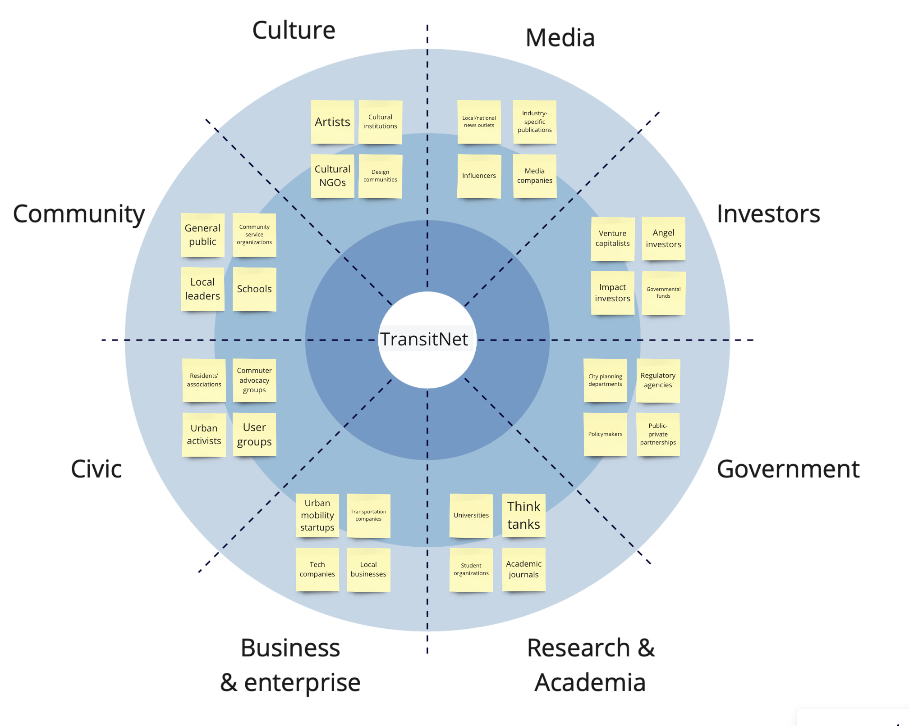

---
hide:
    - toc
---

# Communicating Ideas

Returning to the "Communicating Ideas" class, we delved into various narrative structures, including the monomyth, as explained by Pablo. The concept of the monomyth, or the hero's journey, is intriguing due to its broad applicability across cultures and histories. This narrative structure can transform a simple story into a compelling journey, making it a valuable tool for designers seeking to engage their audience meaningfully.

We also dived into the "Golden Circle" activity, inspired by Simon Sinek. This exercise really shifts the focus from what we do to why we do it, which I think is a game-changer. It's easy to get caught up in the specifics of a project - the 'what' and the 'how' - but starting with 'why' digs deeper into the purpose and the driving force behind our work.

I'm particularly eager to apply this exercise in a conversation with Carlotta. Having worked together on previous projects, I have a deep appreciation for her design approach, which cleverly incorporates behavioral nudges for positive change. Understanding her 'why' will offer valuable insights into the underpinnings of her project and how they inform the more visible aspects of her work. This is more than an exercise in understanding her project; it’s about gaining a deeper understanding of Carlotta as a designer and the motivations that drive her creative process. Engaging in such exercises enriches our understanding of our peers' work and strengthens our connections within the design community.

## My Golden Circle 

For my thesis project, for the time being called "TransitNet," I am focusing on a systemic understanding of transportation systems in urban centers. This project is about decoding the complexity of urban mobility and envisioning sustainable transformations.

**What We Do**: "TransitNet" analyzes and reimagines urban transportation systems. By employing a blend of AI, strategic foresight, and systemic thinking, the project dissects the intricate web of mobility in urban centers. It creates speculative scenarios and data-driven models to understand and project the evolution of these transportation systems. This project aims to make the complexity of urban transportation systems more understandable and actionable.

**How We Do It**: The methodology hinges on using system archetypes – recurring patterns and behaviors in systems – to decode current urban transportation dynamics. These archetypes help in identifying leverage points in the system where interventions could be most effective. By integrating AI algorithms and immersive technologies, the project brings these scenarios to life, offering a tangible glimpse into potential futures of urban mobility. This approach not only illustrates the current state of urban transportation systems but also models potential changes and their likelihood, providing a grounded yet visionary perspective on future transformations.

**Why We Do It**: The driving force behind "TransitNet" is the urgent need to address the sustainability challenges in urban transportation. As population centers grow and evolve, the strain on transportation systems intensifies, often leading to increased emissions and environmental degradation. By providing a clearer understanding of these systems and their potential for change, this project aims to influence policy-making and community action. The ultimate goal is to align urban transportation more closely with global emission reduction targets, making a significant contribution to the broader fight against climate change.

Reflecting on the "TransitNet" project, I see it as a crucial step in bridging the gap between complex systemic theory and practical, impactful interventions in urban transportation. Using system archetypes to explain current states and possible futures of these systems brings a level of clarity and accessibility to what are often seen as overwhelming challenges. The focus on probable changes and their impact on global emission goals offers a pragmatic yet hopeful outlook on the potential for transformation. This project embodies my commitment to creating sustainable, efficient, and equitable urban environments, leveraging the power of technology and systemic thinking to make a tangible difference.

## Stakeholder Map

A stakeholder radar is a strategic tool used to map out the diverse array of individuals, groups, and entities that have an interest or stake in a project or business. It visualizes the relationship and influence of different stakeholders across various domains such as Culture, Media, Investors, Government, Research & Academia, Business & Enterprise, Civic, and Community. This visual representation helps in identifying key players whose needs and concerns must be considered and addressed. It is especially useful in complex projects where the impact is broad and multifaceted, as it ensures a comprehensive engagement strategy that aligns with the project's objectives and values.

Reflecting on populating my stakeholder radar for the "TransitNet" project, the reasoning behind each category of stakeholders is rooted in the project's multifaceted nature, aiming to systematically reimagine urban transportation.

In the Culture category, including artists and design communities is essential because they help reimagine and communicate the future of urban mobility in ways that resonate with the public. Their creative perspectives are invaluable in challenging the status quo and inspiring a more human-centered approach to transportation systems.

The Media plays a crucial role in shaping public opinion and discourse. By engaging with news outlets and influencers, the project can gain visibility and drive the narrative around sustainable urban mobility, influencing public perception and fostering a broader dialogue on the subject.

Investors are critical for providing the financial backing necessary to develop and scale the project. Impact investors and venture capitalists, in particular, can offer the resources to turn speculative designs into tangible solutions.

Engagement with the Government sector is crucial, as policy-making and regulatory frameworks are the bedrocks upon which the project's proposals can be implemented. Collaboration with public-private partnerships could provide the project with a practical pathway for integration into existing urban infrastructures.

Research & Academia are the intellectual backbone of the project, offering rigorous insights and innovation. Universities and think tanks can contribute cutting-edge research that informs the AI models and systemic analyses we conduct.

Business & Enterprise stakeholders, from startups to established companies, are the operational arms that can bring the project's visions to life. They offer the technological capabilities and market knowledge essential for developing viable urban mobility solutions.

In the Civic domain, local advocacy groups and residents' associations are the voices of the community. Their participation ensures that the project's outcomes align with the needs and values of those who will be most affected by changes in urban transportation.

Finally, the Community at large represents the end-users, whose daily lives are intertwined with the urban transportation systems. Engaging with the general public, schools, and local leaders ensures a user-centric approach, grounding the project in real-world contexts and needs.

In summary, each category of the stakeholder radar has been chosen not only for their potential impact on the project but also for their ability to be impacted by the project's outcomes. This radar facilitates a holistic view, ensuring "TransitNet" remains a well-informed, inclusive, and feasible venture that can adapt to the complexities of transforming urban transportation systems.

## Tandem Project

Reflecting on my interview with Carlotta, I got a really good grasp of her thoughtful approach towards sustainable energy and design. It's clear she's deeply invested in finding practical, tech-driven solutions for the current energy challenges.

Carlotta's focus is on creating products and services that blend hardware and software, leveraging emerging technologies to facilitate this transition period from non-renewable to renewable energy sources. She mentioned the growing energy demand and how our existing grids are struggling to cope. This situation, in her view, underscores the urgency for designing solutions that are adaptable to the shift towards renewable energy.

What stood out to me was her methodical approach to design. Drawing from her background in industrial design engineering, she's keen on thoroughly researching problems and behaviors. This research then informs her ideation process, leading to the development of prototypes for physical devices or services. It’s not just about creating new things but understanding the underlying behaviors and patterns that can influence energy usage.

In discussing the integration of technologies like AI and open-source approaches, Carlotta emphasized their potential for adaptability and customization. She sees these technologies as essential in creating solutions that are applicable in various contexts. For instance, the way an algorithm might be used to manage energy consumption in one community could be very different from its application in another. This adaptability, enabled by open-source design, allows for a broader application of her solutions.

The community-driven aspect of her work also resonated with me. Carlotta is keen on seeing how communities can drive sustainable change. She mentioned the balance between motivation and shame in promoting sustainable behaviors within a community. Finding that balance is crucial – it’s about encouraging positive change without making people feel pressured or judged.

Lastly, Carlotta talked about the importance of balancing sustainable living with economic practicalities. She highlighted the energy crisis, pointing to recent global events that have shown how fragile our energy supply can be. Her approach isn’t just environmentally focused but also considers economic factors, especially for those in vulnerable communities.

All said and done, it was a cool chat. Carlotta's got some interesting ideas, especially about mixing the psychological aspects of design with practical solutions to strive for better outcomes. It's great to see someone thinking about how design can make a real difference, not just in terms of sustainability but also in terms of making life better for different communities.

<iframe width="560" height="315" src="https://www.youtube.com/embed/5q97TFOIMYo?si=rcyeseDg91mECo_7" title="YouTube video player" frameborder="0" allow="accelerometer; autoplay; clipboard-write; encrypted-media; gyroscope; picture-in-picture; web-share" allowfullscreen></iframe>