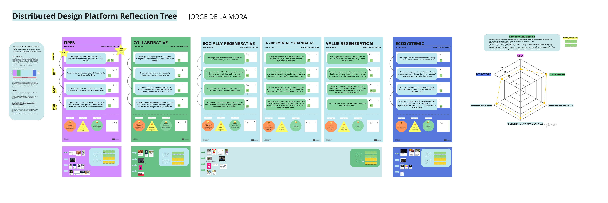

---
hide:
    - toc
---

# Future Talk

## Distributed Design

For the Future Talk, we're learning about distributed design. 
Distributed design is a paradigm that reimagines the traditional processes of design and production, leveraging the power of digital technologies and networks to democratize the creation and distribution of products and ideas. In this approach, design is no longer confined to a specific location or a centralized group of experts. Instead, it becomes a collaborative, global effort, harnessing the collective creativity and expertise of a diverse and dispersed community.

This model of design challenges and expands our conventional understanding of manufacturing and distribution. By utilizing digital platforms, open-source principles, and advanced fabrication technologies, distributed design enables designers and creators to share their work with a worldwide audience. Designs can be downloaded, modified, and physically produced in local Fab Labs or maker spaces, anywhere in the world. This not only reduces the environmental impact associated with transportation but also empowers local communities by fostering innovation, skill development, and economic opportunities.

Guided by Jessica Guy and Olga Trevisan, we're using the Reflection Tree framework in Miro. It's a hands-on tool that helps us figure out where our projects stand in becoming a part of distributed design. It's all about understanding the impact of our projects in line with the values of the Distributed Design Platform.

The Reflection Tree makes us think about how our projects align with key values like being open, collaborative, regenerative, and ecosystemic. We're learning that it's not about scoring perfect points but being honest about where our project is at and where it can go. It’s about understanding the impact we’re making and identifying areas for improvement.

Reflecting on the Reflection Tree exercise, several key takeaways have emerged, particularly in relation to my thesis project's direction, whether it be Music Creation, Heat as an Inescapable Experience, or Systemic Mobility.

Understanding the Distributed Design Landscape: The Reflection Tree has been instrumental in clarifying how my project aligns with distributed design principles. It's helped me see where my project excels and where it needs more development. The high scores in Collaboration (20/20) and Environmental and Value Regeneration (both 18/20) suggest a strong alignment with the collaborative and sustainable ethos of distributed design. However, the slightly lower score in Openness (14/20) and Ecosystemic (15/20) aspects indicate areas for improvement, emphasizing the need for greater openness and integration within broader systems.

Strategic Foresight and Systemic Thinking: The exercise reinforced my decision to use strategic foresight and systemic thinking in my design process. These methods are vital for understanding the broader context and implications of my project. They enable a holistic view of how my work fits into and impacts larger systems, which is crucial for creating meaningful, sustainable designs.

Embracing Advanced Technologies: The Reflection Tree also highlighted the importance of integrating AI and immersive computing into my project. These technologies can significantly enhance the research, ideation, and exploration phases, offering deeper insights into context, user needs, and potential project impacts. Their use aligns well with the high scores in collaborative and regenerative values, suggesting that these technologies can be leveraged to foster greater collaboration and sustainability.

Open Reflection on the Tool: The Reflection Tree is more than just a scoring system; it's a tool for deep introspection. It's not about achieving perfection but about honest assessment and playful engagement. While it's gratifying to see high scores in several areas, the true value lies in understanding the nuances of each score. The tool has been effective in guiding me to think critically about every aspect of my project, from conception to potential real-world impact. It's a reminder that design is not just about creating something new, but about doing so responsibly, sustainably, and in a way that benefits both people and the planet.

To conclude, the Reflection Tree has been a very good tool in shaping my approach to my thesis project. It's guided me to consider the broader implications of my design choices and how they align with the principles of distributed design. The exercise has been enlightening, challenging me to strive for balance across different dimensions of my project, and ensuring that my work is not just innovative, but also socially and environmentally responsible.