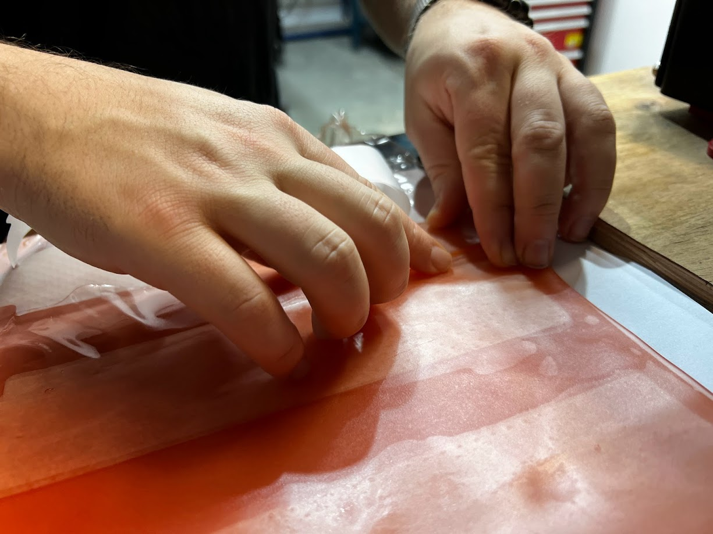
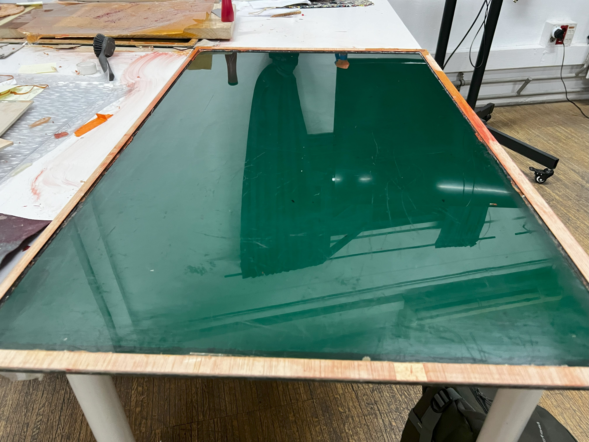
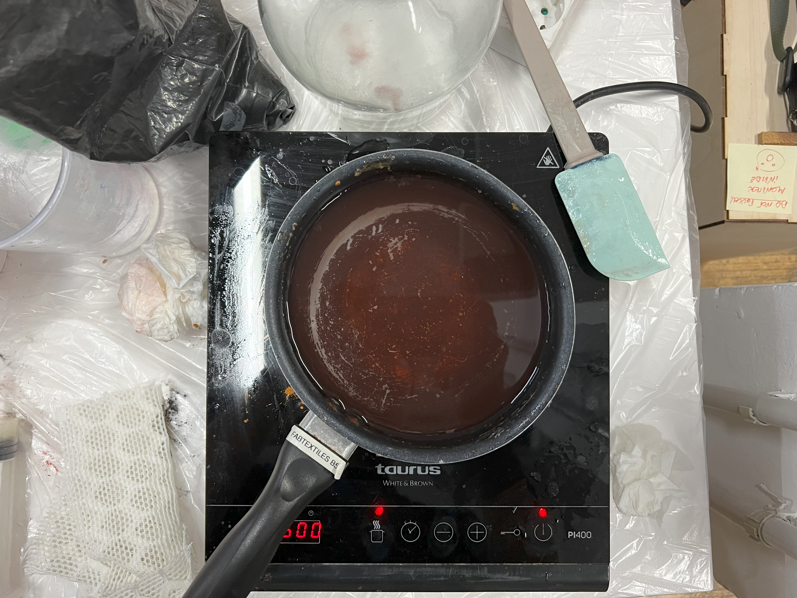
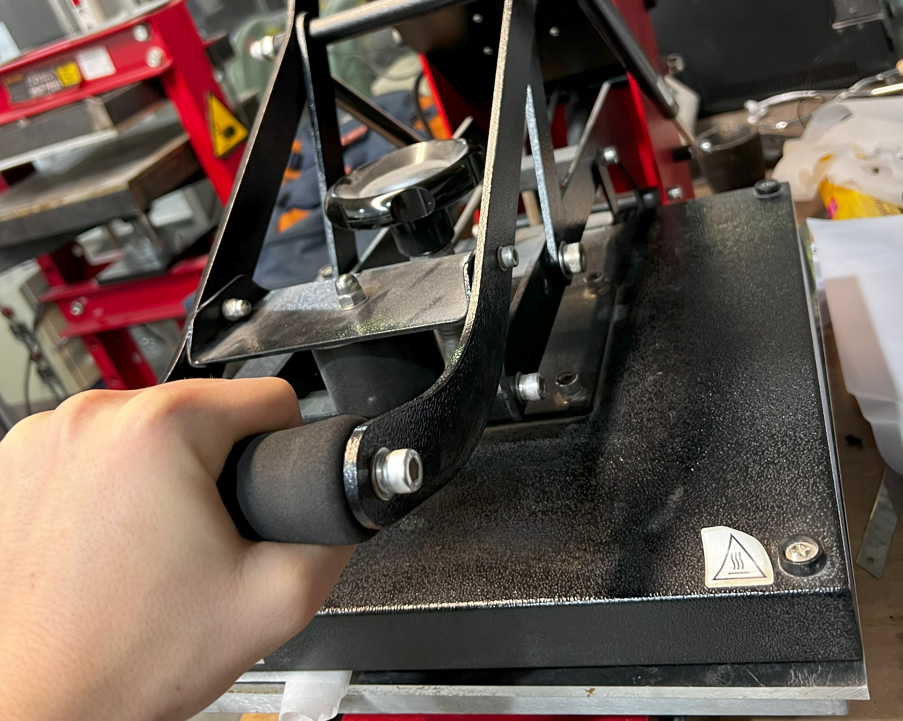

---
hide:
    - toc
---
# Digital Prototyping for Design Project 01: Bio Packaging for Drone Delivery

Reflecting on how my teammate for this project [Oliver Lloyd](https://oliver-lloyd-mdef.github.io/Oliver-MDEF-Portfolio/Term%202/03.%20Digital%20Prototyping%20for%20Design.html) and myself took this endeavor to create a gelatine-based inflatable as an innovative solution to the pervasive issue of single-use packaging, the journey from conception to prototype was both challenging and enlightening. Partnering with my classmate, we embarked on this project with a shared vision to redefine how goods, especially those delivered by drones in the near future, could be protected in transit while addressing the critical issue of environmental sustainability.

### Why the Initiative?
Our mutual interest in the evolving landscape of transportation, particularly the anticipated rise in drone deliveries, sparked a curiosity about the environmental impact of current packaging practices. It was evident that the prevalent use of single-use inflatable plastics was unsustainable. Motivated by the urgency to find an eco-friendly alternative, we explored the potential of biodegradable materials that could offer protection without leaving a lasting footprint on the planet.

### The Conceptualization
After delving into various materials and methodologies, we settled on the idea of utilizing a gelatine biopolymer to craft an inflatable packaging solution. This concept aimed to provide a safeguard for transported goods using a material that could easily dissolve in water, ensuring a harm-free return to the earth post-use.

### The Prototype Development
Our prototyping process was grounded in the integration of 2D fabrication techniques, specifically laser cutting, with the unique properties of our chosen biomaterial. We envisioned a sheet punctuated with air pockets that, once inflated, could envelop and protect any item placed within its embrace.

### Materializing the Vision
Creating the gelatine-based biopolymer sheet was a delicate balance of art and science, involving a simple yet precise recipe of water, glycerine, and gelatine. Our aim was to produce a material that was not only durable but also maintained the necessary flexibility for inflation. The crafting process, from mixing the ingredients to casting the gelatine into a meticulously designed mould, was a testament to our commitment to precision and sustainability.

### Overcoming Challenges
One of the pivotal moments in our project was mastering the sealing technique to ensure air pockets remained intact upon inflation. Initial experiments led us to the discovery that a lower temperature was crucial to avoid compromising the integrity of the gelatine sheet. This insight allowed us to fine-tune our process, achieving a perfect seal that held the promise of protection.

### Hypothesis and Ramifications
Our hypothesis that materials such as gelatine are profoundly interesting for their ability to dissolve in water challenges conventional packaging methods. This characteristic opens up fascinating possibilities for reimagining logistics chains worldwide. Imagine a future where packaging not only protects its contents but also seamlessly returns to nature, reducing waste and environmental impact. The ramifications of such interactions with packaging could revolutionize the way we think about and engage with product protection within global logistics.

### Reflections and Future Directions
This project was a profound learning experience, revealing the untapped potential of biodegradable materials in addressing the environmental challenges posed by current packaging practices. The success of our inflatable prototype not only validated our concept but also ignited a passion to further explore and refine this solution. As we look to the future, the possibilities for scaling and enhancing the durability and functionality of our gelatine-based packaging are boundless. This endeavor has reinforced my belief in the power of innovative thinking and collaborative effort to drive meaningful change in how we approach design and sustainability.

The journey of creating this gelatine-based inflatable has been a pivotal chapter in my exploration of sustainable design solutions. It stands as a beacon of what can be achieved when we dare to think differently and commit to making a positive impact on our world.

<iframe width="560" height="315" src="https://www.youtube.com/embed/z4iPZfoDtFw?si=1WGvf2kUI9H0bScc" title="YouTube video player" frameborder="0" allow="accelerometer; autoplay; clipboard-write; encrypted-media; gyroscope; picture-in-picture; web-share" allowfullscreen></iframe>

### Resources

[Our Fabrication files](https://drive.google.com/drive/folders/1OUpeHhaR7vIsqFo_2l2Ze99QtsDSC7oc?usp=sharing)

[Saskia Helinska @ Fabricademy](https://class.textile-academy.org/2022/saskia-helinska/finalproject.html)
[Airtight Self-Sealing Inflatable](https://www.instructables.com/Airtight-Self-Sealing-Inflatable/)
[MOT – making the invisible visible](http://class.textile-academy.org/2019/Montserrat/week11.html)
[Homemade Bioplastic : gelatin](https://www.youtube.com/shorts/Lzp4nMNNmuM)

