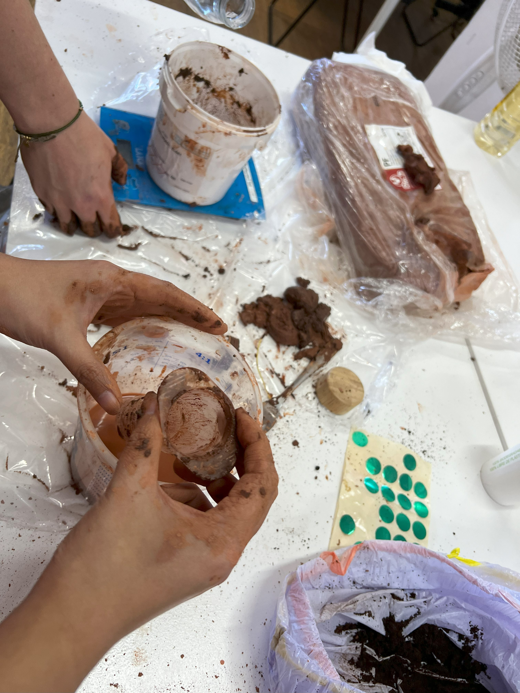
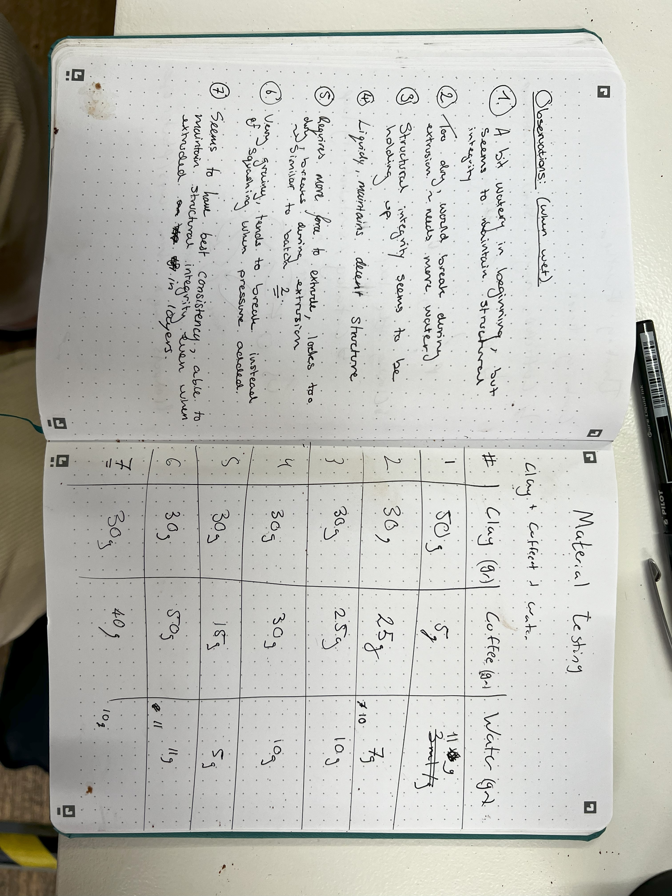
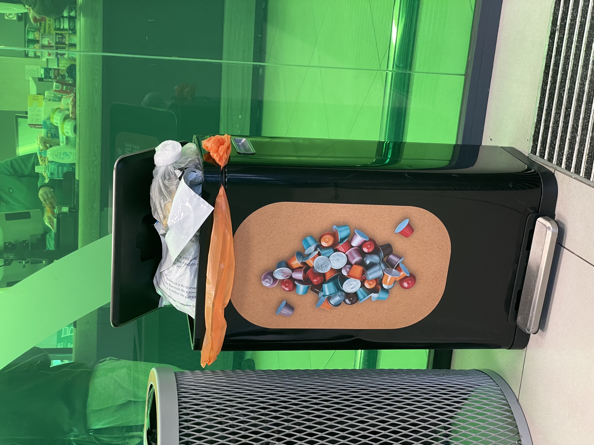

---
hide:
    - toc
---
# Digital Prototyping for Design Project 02: Clay Printing and Circularity of Coffee Pods

In this new exploration with [Oliver](https://oliver-lloyd-mdef.github.io/Oliver-MDEF-Portfolio/Term%202/03.%20Digital%20Prototyping%20for%20Design.html) we looked into the potential of Clay and Coffee Grounds for sustainable design, an intriguing challenge that perfectly aligned with our curiosity towards innovative materials and circular economy principles. Driven by a shared vision to rethink and revitalize the way we approach product packaging and waste, embarked on a fascinating journey with our Clay/Paste Printer—a modified Ender 3 designed for extruding paste-like materials such as clay and various bio-materials.

### Discovery and Open Source Innovation
What struck me most about this printer was its open-source nature, making the entire project not just a learning experience but also a contribution to the wider community. The clear, accessible documentation on constructing such a printer laid the foundation for our exploratory project.

## “Would it be possible to create a closed loop system where waste coffee grounds are mixed in with clay to create new and exciting products that can be returned to the cafes from where the coffee was collected?”

### Material Exploration and Ideation
The choice to blend coffee grounds with clay for the creation of coffee cups and related items was driven by our aspiration to embed circularity into everyday items. Influenced by the innovative reuse and repurposing seen in the work of design studios like Gomi and Super Local, we embarked on a day filled with experimentation. Our goal was to find the perfect balance between coffee and clay that would ensure adhesion, flow, structural integrity, and a pleasing aesthetic. After numerous trials, we identified a promising mixture that seemed to meet our criteria.

- Adhesion ~ how well can the mixture hold itself together?
- Flow ~ How easily can the material flow out of the nozzle for easy printing
- Structural Integrity ~ How well can the material hold its shape when dry
- Look & Feel ~ Does the material look appealing and does it feel good when held in the hand?

### Challenges and Triumphs in Printing
The journey from material preparation to the actual printing process was fraught with challenges, from calibration issues to material consistency problems. Despite these hurdles, our persistence paid off, culminating in a successful test print that embodied our vision for a sustainable design solution.

A mixture of 50g of clay to 15g of Coffee with about 10ml of water

We found that more coffee created too much of a grainy material, that couldn’t hold itself together well enough to be structurally sound, and when it dried it would simply disintegrate to the touch.

### Reflections and Anticipation

Our experimental blend of clay and coffee grounds represents a solid step towards sustainable material innovation. However, the true test lies in the kiln firing process, which will reveal the durability and stability of our creations, aswell as the other processes that might be necessary to make truly useful clay + coffee products, such as the glazing process, and it's timing within the curing process of the material. This anticipation underscores the exerimental nature of our project and the exciting potential for future explorations.

Timelapse of successful print:

<iframe width="628" height="353" src="https://www.youtube.com/embed/55KOT3PRNuc" title="ClayCoffeeTestPrint" frameborder="0" allow="accelerometer; autoplay; clipboard-write; encrypted-media; gyroscope; picture-in-picture; web-share" allowfullscreen></iframe> 

### Successful prints

[Fabrication files](https://drive.google.com/drive/folders/13k5POCozkYfd1uqA7kvGz9sHUE4e0U9D?usp=sharing)

### Looking Ahead
The prospect of integrating other materials into clay mixtures opens up new avenues for sustainable product design. This project not only showcases the potential of combining traditional and innovative materials but also exemplifies how design thinking can contribute to a more sustainable future. As we await the results from the kiln, our minds are already racing with possibilities, dreaming of expanding this concept into a broader initiative that further closes the loop on material use in our society.

This endeavor, blending the old with the new, the traditional with the innovative, has been a remarkable journey of discovery, collaboration, and hope for a more sustainable world. Through this project, we've glimpsed the future of design—a future where materials tell a story of regeneration, creativity, and community.

# A Circular Approach to Coffee Waste

Diving deeper into the realm of sustainable design and the circular economy, my project took an innovative turn towards leveraging waste coffee pods from Mercadona's own brand Hacendado. This initiative not only sought to address environmental concerns but also aimed at creating a tangible connection between waste reduction and consumer engagement. My experience within Valencia's vibrant innovation sphere, particularly through participation in hackathons and entrepreneurial events, has enriched my perspective on the potential for startups and partnerships to drive significant change. This background became a cornerstone in conceptualizing a project that could bridge the gap between sustainability and practical consumer benefits.

### Redefining Circular Economy Through Design

The project's ambition was to transform used coffee pods, a symbol of modern convenience and subsequent waste, into a resource for crafting designer home and kitchen products. This vision aligned with the principles of the circular economy, where the lifecycle of materials is extended through innovative reuse and recycling practices. By integrating coffee grounds and the plastic from coffee pods into a clay mixture for 3D printing, we envisioned a range of products that not only showcase sustainable design but also encourage consumer participation in circular practices.

### Exploring MVP with Mercadona and Marina de Empresas

Considering my ingrained connection with Valencia's innovation ecosystem, the project naturally evolved towards exploring a Minimum Viable Product (MVP) that could potentially work in collaboration with Mercadona or as a startup incubated by Marina de Empresas. This collaboration would leverage the widespread presence of Mercadona and its commitment to sustainability, alongside the entrepreneurial spirit fostered by Marina de Empresas. The goal was to create a closed-loop system where consumers could return used coffee pods at any Mercadona location, contributing to the production of eco-friendly, desirable products. This system not only proposes a solution to waste but also adds value to the consumer's journey towards sustainability.

### Future Directions and Entrepreneurial Potential

As the program progresses, the aspiration to further develop this concept into a scalable solution remains a priority. The potential for this initiative to evolve into a startup or a collaborative project with established companies like Mercadona opens numerous possibilities for impact. The entrepreneurial environment in Valencia and Barcelona, rich with opportunities for innovation and support for startups, provides a fertile ground for such sustainable ventures to grow.

### Reflection and Commitment to Sustainable Innovation

This journey through digital prototyping and material experimentation has reinforced my belief in the transformative potential of design. By merging the principles of the circular economy with innovative fabrication techniques, we can create solutions that not only address environmental issues but also enrich our lives with meaningful products. My continued exploration in this domain, supported by Valencia's innovation ecosystem, aims to contribute to a future where design and sustainability go hand in hand, creating a world where good decisions are easy and rewarding for everyone.

