---
hide:
    - toc
---

# Fair Futures: Collaboration with SODA

Reflecting on the Fair Futures week, our collaboration with SODA at Manchester Metropolitan University, facilitated through Discord, was both unique and immensely enriching. This experience, especially taking classes with SODA's students under the guidance of Olga Trevisan, Jessica Guy, Ámbar Tenorio-Fornés, and Ax Mina, deepened my understanding of distributed design and its critical role in shaping values-driven projects.

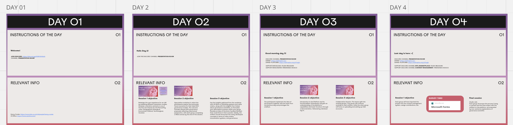

## Ideation

The discussions around distributed design felt particularly relevant to the evolution of one of my overarching projects, MoveNet. 
The initial exercise, which involved examining past works through the lens of distributed design, was an eye-opener, underscoring the importance of integrating core values right at the heart of urban mobility solutions. This aligns perfectly with MoveNet's ambitions to reimagine urban transportation systems that are not only efficient but also equitable and community-focused.  

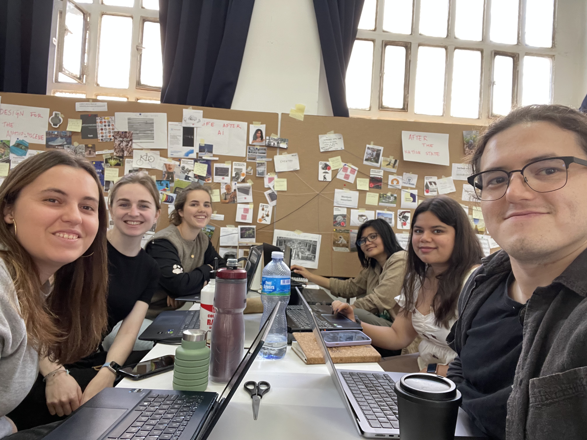
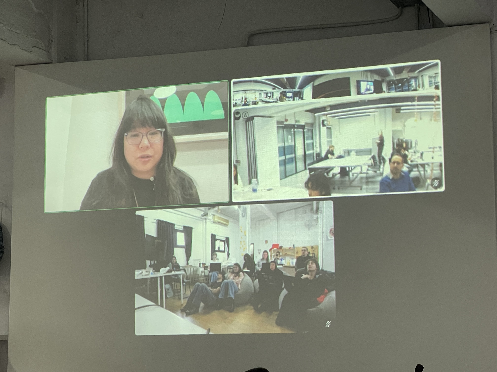
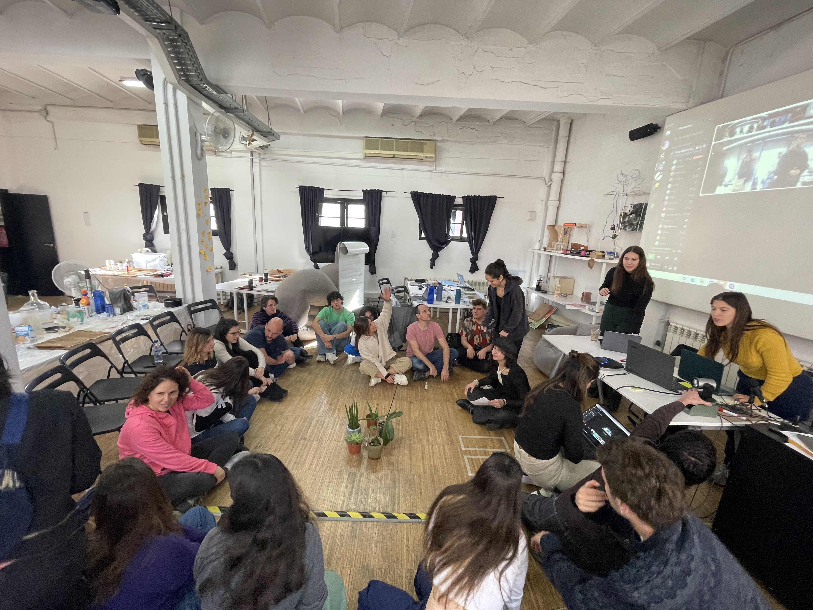

What stood out to me during our brainstorming sessions was how some of the subjects I proposed, particularly concerning the "Unavoidable heat experience" in urban centers, caught on and were picked up by another team. It was affirming to see ideas I contributed spark interest and become central themes for exploration. This validated my sense that the issues I'm drawn to are also resonating with my peers, highlighting shared concerns and the collective urge to tackle such pressing design challenges.

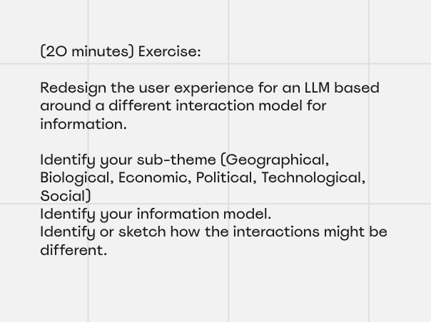
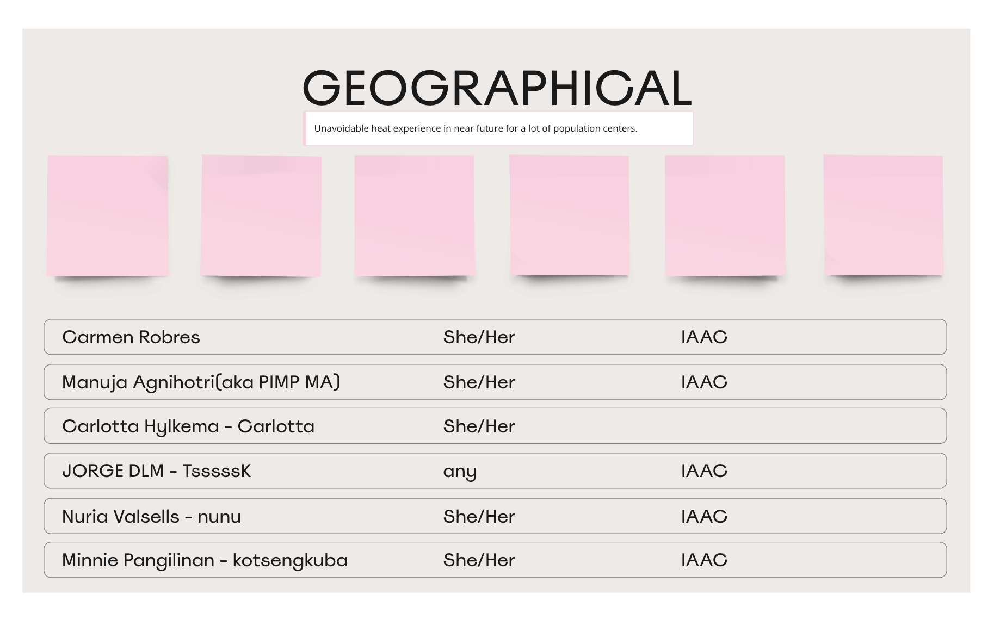
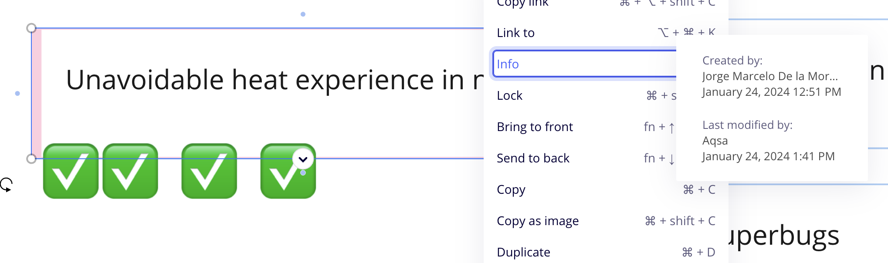

## Second Round

The pivot from an initial focus on architects and builders to a more community-centric approach exemplifies the fluid nature of design thinking and the potential of distributed design to empower communities. Our final concept of a blockchain-enabled platform that rewards energy-efficient efforts illustrates the innovative blending of technology and social incentives to foster change. 

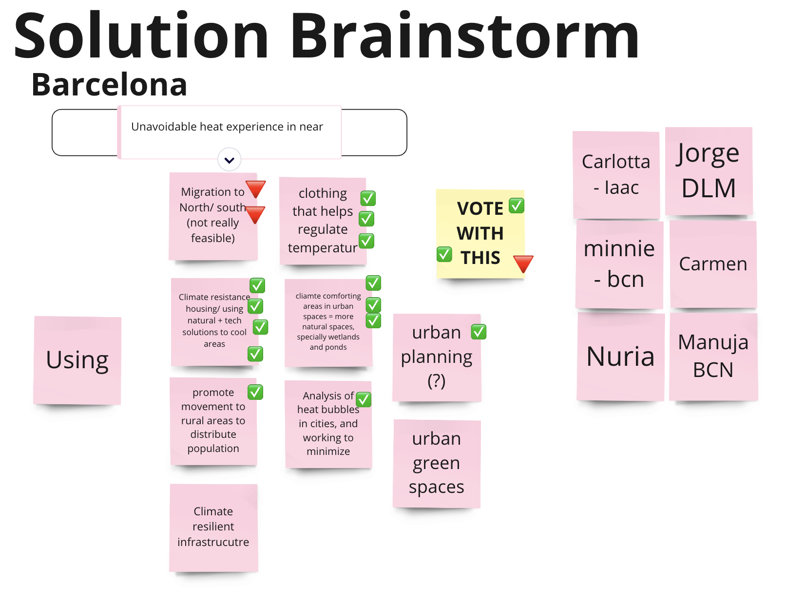
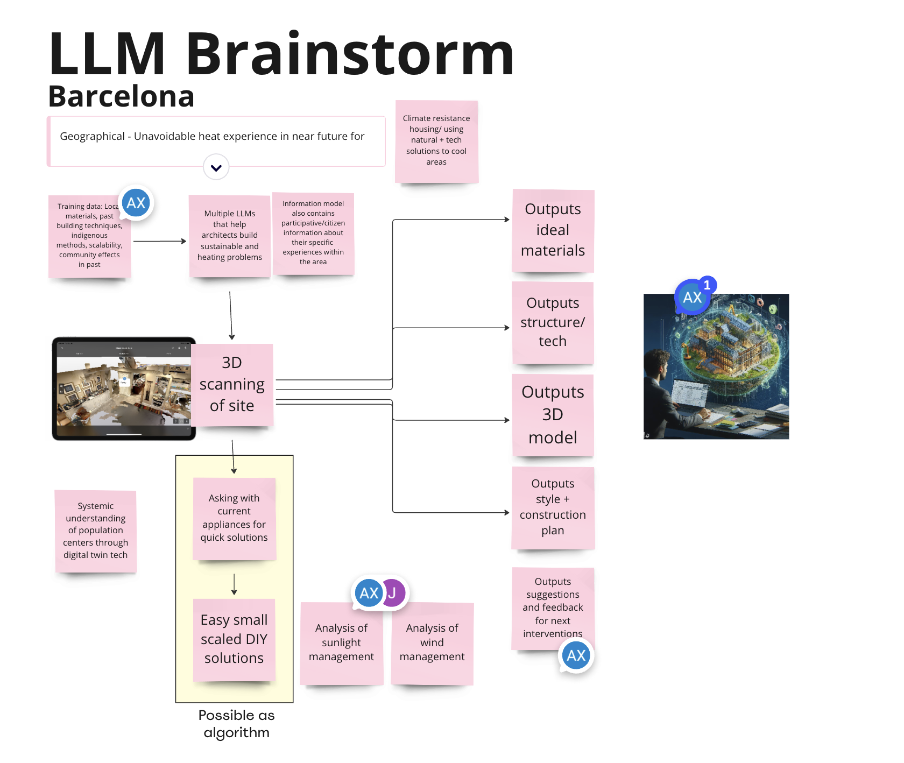
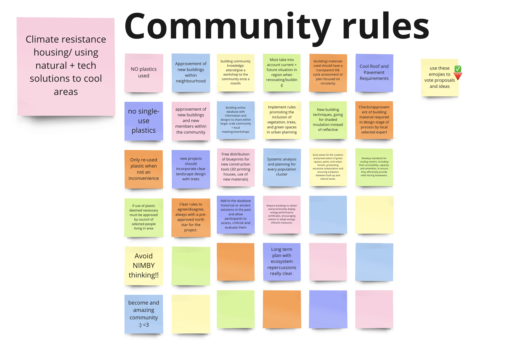

The resulting project project, with its focus on rewarding eco-friendly practices through EcoTokens, smart thermostats for efficient temperature regulation, and the use of DAOs for community governance, exemplifies a forward-thinking solution to environmental challenges. This initiative underscores the importance of transparent communication, democratic decision-making, and clear rules encoded in smart contracts to ensure fairness and goal alignment.
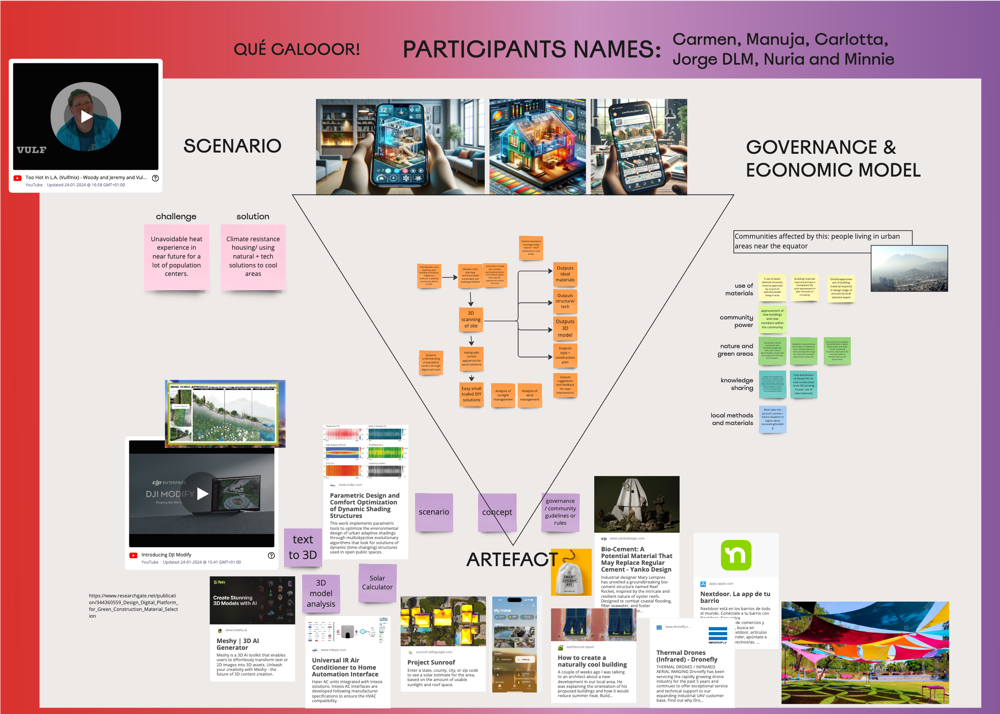

## ETCI: EcoTokens for better tomorrows

The EcoToken Community Initiative (ETCI) is an innovative approach to tackling climate change, particularly focusing on reducing energy inefficiency in residential heating and cooling systems. This initiative is crucial as it addresses a significant contributor to carbon emissions and aims to foster a sense of responsibility and community engagement toward more sustainable energy practices. By leveraging blockchain technology for transparency and accountability, and integrating smart devices for energy management, ETCI offers a comprehensive solution that not only incentivizes individuals but also empowers communities to make impactful decisions regarding their environmental footprint.

Challenges Addressed by ETCI
ETCI confronts the urgent issue of climate change by focusing on energy inefficiency in homes, a notable source of environmental degradation. The initiative seeks to overcome the hurdles of engaging communities in sustainable practices and integrating cutting-edge technology in an accessible and incentivizing manner. These challenges are met with a unique blend of technology and community governance, ensuring participation and positive behavioral changes toward energy consumption.

Solutions Proposed by ETCI
The multi-phased solution proposed by ETCI combines blockchain technology with smart thermostats and community-driven governance mechanisms. By rewarding eco-friendly practices with EcoTokens, the initiative encourages individuals to adopt more sustainable energy habits. Blockchain ensures data integrity and transparency, essential for building trust among participants. Moreover, the formation of local DAOs allows communities to democratically decide on sustainable projects, fostering a collaborative approach to environmental stewardship.

Communication, Governance, and Rules
ETCI's governance structure is rooted in DAOs, promoting democratic and transparent decision-making within communities. Communication is secured and decentralized through blockchain technology, ensuring that all stakeholders can engage openly. The rules, embedded in smart contracts, dictate the mechanics of EcoToken distribution, temperature data recording, and execution of community decisions, ensuring adherence to the initiative's goals.

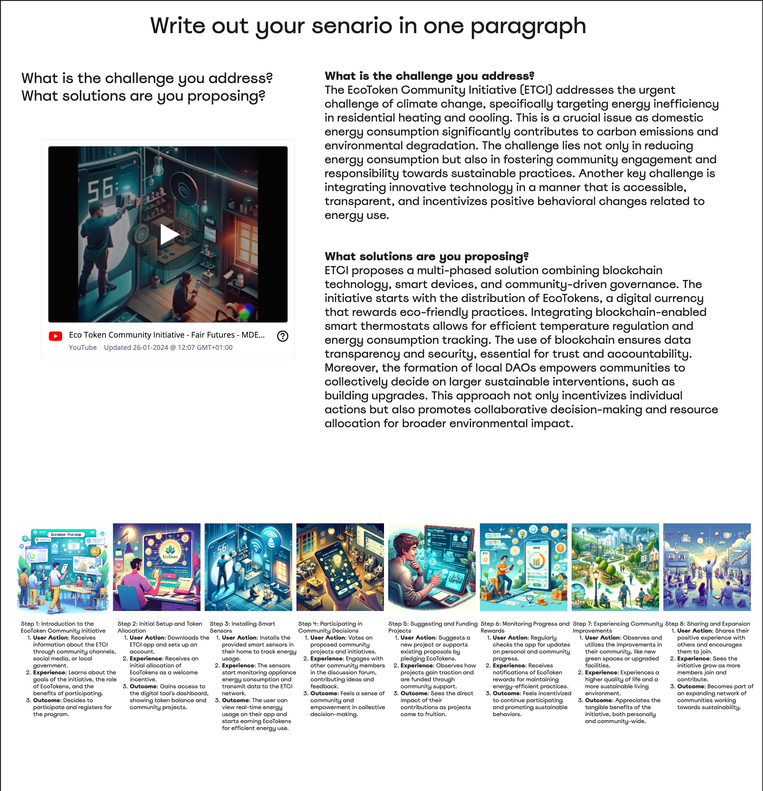
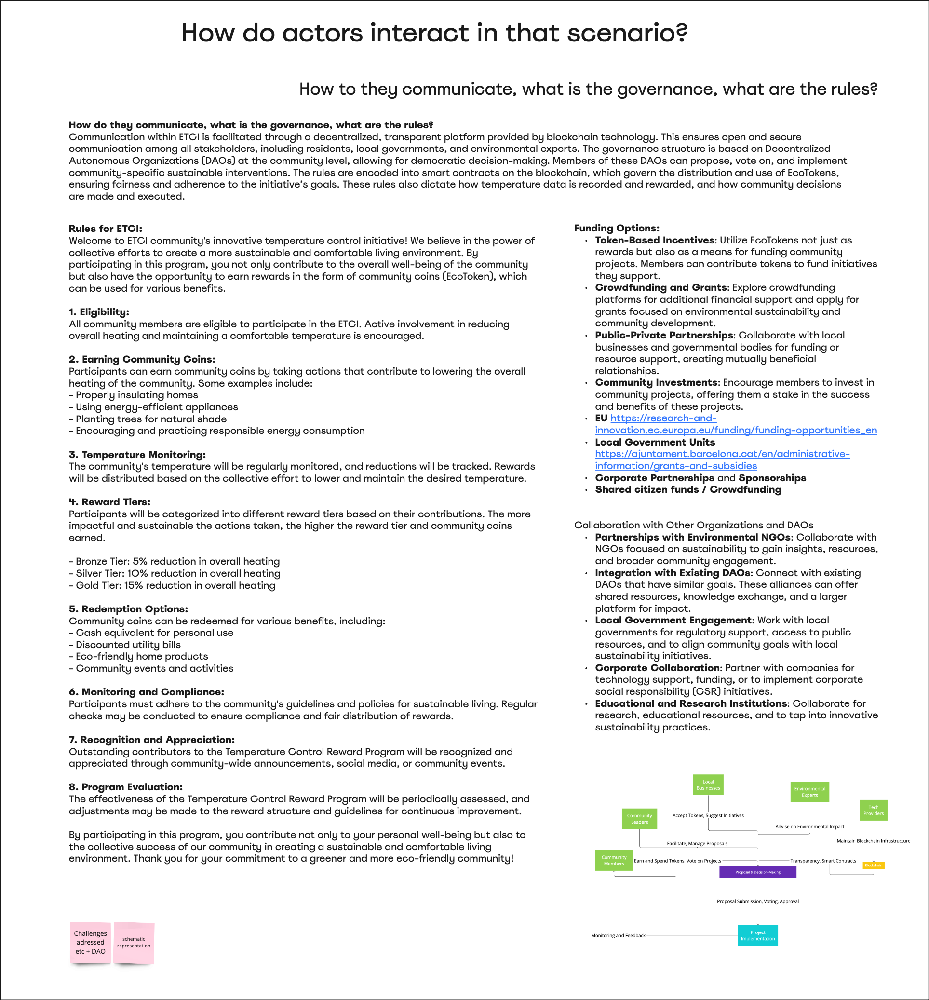

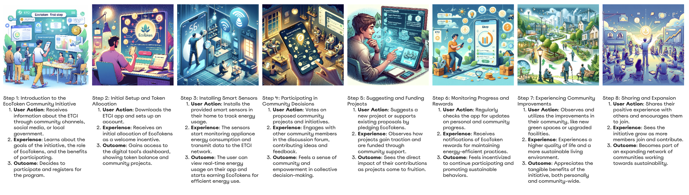

<iframe width="560" height="315" src="https://www.youtube.com/embed/A8hRgg31NVM?si=UO6bNHJBkIwGkGOH" title="YouTube video player" frameborder="0" allow="accelerometer; autoplay; clipboard-write; encrypted-media; gyroscope; picture-in-picture; web-share" allowfullscreen></iframe>

### Parallels with MoveNet

Drawing parallels to MoveNet, a project aimed at enhancing urban transportation systems, both initiatives share a common goal of sustainable urban development. Like ETCI, MoveNet could benefit from integrating blockchain for transparent and secure data management and adopting a community-driven approach to decision-making. Both projects highlight the importance of leveraging technology not just for efficiency but as a means to foster community engagement and drive systemic changes towards sustainability.

In summary, the Fair Futures week reinforced the significance of community-centric design and the potential of emerging technologies to support sustainable behaviors. The resonance of the subjects I'm passionate about with my peers further motivates me to continue exploring these avenues, ensuring that my other projects aim not just a solution to challenges but also a catalyst for social change.
