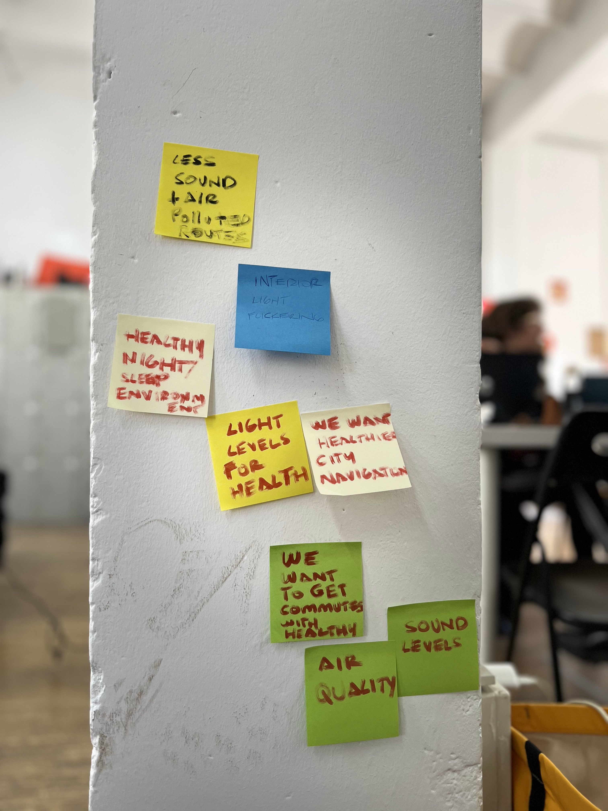
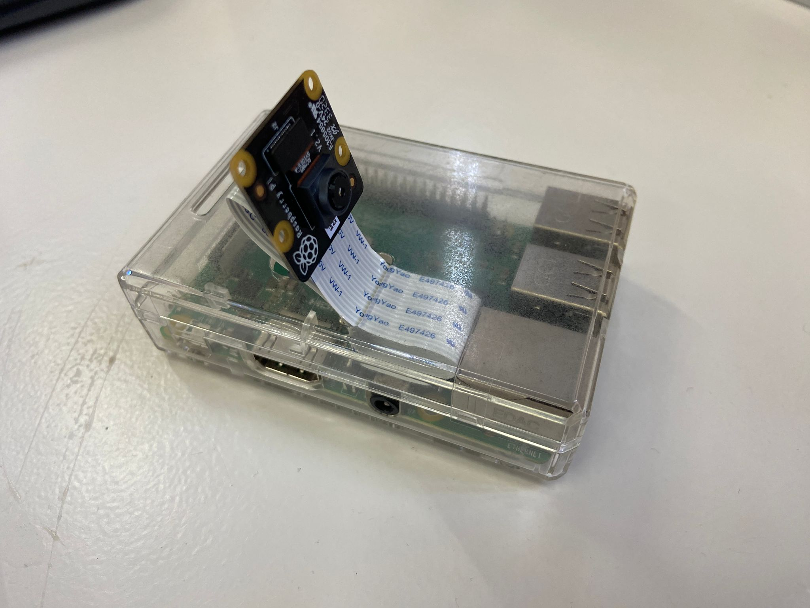
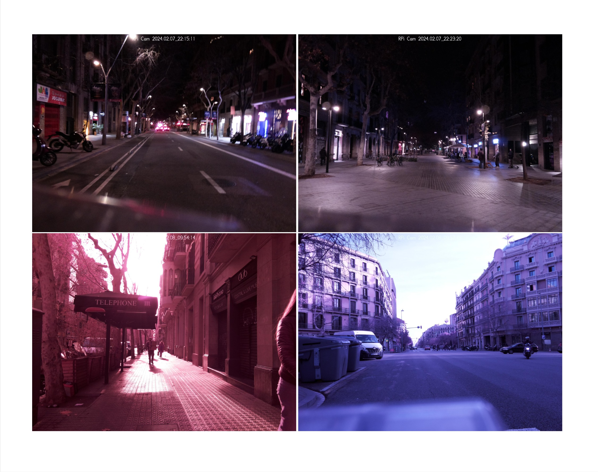
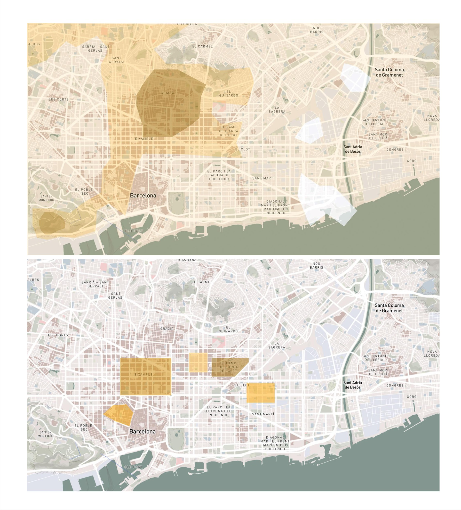
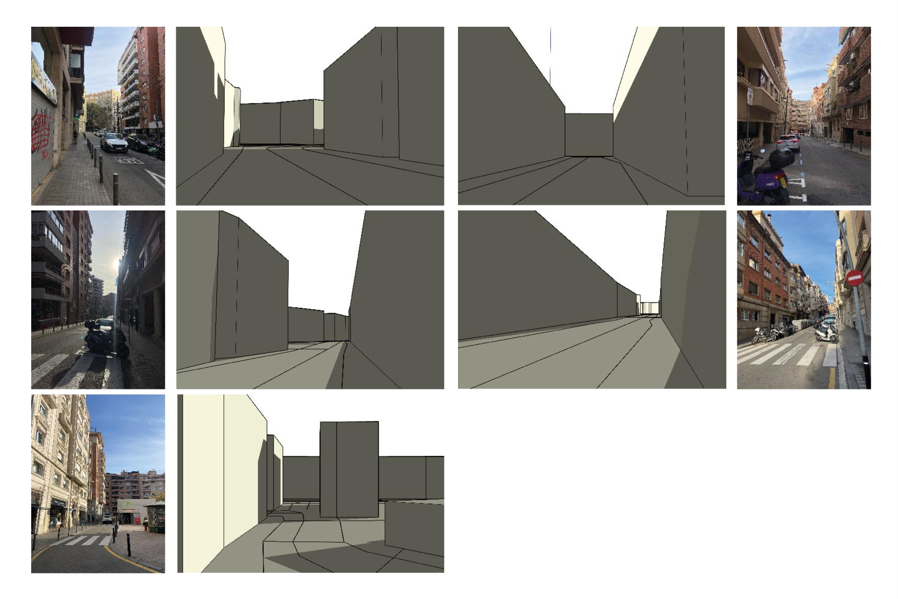

---
hide:
    - toc
---

# Measuring the World: Sensors and Light

Reflecting on the "Measuring the World" seminar led by Oscar Gonzalez, I was thrust into the fascinating world of data collection and its transformation into meaningful insights. This seminar was a deep dive into how we harness the power of sensors and various measuring tools to capture the essence of our environment, and the meticulous process required to refine raw data into actionable information.

### From Raw Data to Knowledge
One of the seminar's core lessons was understanding the journey of raw data as it gets processed into usable information. We explored the nuances between open and closed data sources and pondered over the implications of new, publicly accessible data-gathering technologies like satellites. This opened up a realm of questions about data utilization, brokerage, and the emerging open market for data, prompting us to consider the origins and implications of freely available information.

### Initial Ideation and Hardware Constraints
Our group initially flirted with the idea of mapping the city's sound pollution levels, intrigued by the potential insights this could offer into urban living's auditory landscape. However, the seminar's unique structure, which limited us to specific hardware choices, led us down a path of creative adaptation. Restricted to the Raspberry Pi camera, we found ourselves exploring other environmental factors that impact urban dwellers' well-being.

### Venturing into Sunlight and Well-being
Venturing into the fascinating domain of sunlight and well-being, our project took a deep dive into understanding how urban dwellers interact with natural light and the potential health benefits of optimizing this relationship. In our pursuit of marrying technological innovation with urban planning, we found a unique opportunity to explore the balance between sunlight exposure and shadow in the bustling city of Barcelona. Our curiosity was not just piqued by the aesthetic or environmental implications of sunlight distribution but was deeply rooted in its profound impact on human health—ranging from circadian rhythm regulation to vitamin D synthesis.

In an ambitious attempt to quantify and analyze the city's light exposure, our teammate Carlotta took the lead in developing an ingenious Python script. This script was designed to sift through the myriad of images we collected from our respective neighborhoods, meticulously analyzing and averaging the lighting conditions of each. The goal was to distill vast amounts of visual data into actionable insights, identifying areas bathed in sunlight versus those cloaked in shadow. Carlotta's efforts were pivotal in transforming subjective observations into quantifiable data, offering a fresh lens through which to view our urban environment.

### Exploring the City's Light and Shadow

Our journey began with an exploration of Barcelona's unique urban landscape, characterized by its dynamic interplay of light and shadow. This urban canvas presented us with a profound opportunity to investigate how the city's architecture and spatial configurations impact the well-being of its inhabitants. Our initial ideation phase led us to consider the pervasive issue of sound pollution—an omnipresent challenge in urban environments. We envisioned harnessing the potential of sensors to map the city's soundscape, aiming to understand and mitigate the impact of noise pollution on residents' quality of life. 

We delved into how urban living conditions, particularly the availability of natural light and the design of public spaces, influence health and happiness. This exploration was grounded in a holistic understanding of well-being, recognizing the intricate relationship between physical health and environmental factors such as light exposure. Our project evolved into a multifaceted investigation, examining how urban design can foster environments that support both physical and psychological well-being.

### The Group Project's Evolution

To bolster our analysis and ensure the robustness of our findings, we ventured beyond mere observation. We harnessed actual 3D data from the neighborhoods in question, employing this rich dataset to simulate sunlight and shadow patterns across different times of the day and year. This innovative approach allowed us to draw parallels between our empirical data and simulated models, offering a comprehensive understanding of each neighborhood's unique light exposure profile.

This exploration was more than a technical exercise; it was a journey into the potential of data to inform and enhance urban living experiences. By juxtaposing real-world observations with digital simulations, we uncovered fascinating insights into how residents of Barcelona interact with their environment. This methodology opened up a myriad of possibilities for designing urban experiences that cater to individuals' preferences for sunlight or shade, tailored to their specific location within the city.

Our venture into sunlight and well-being exemplifies the power of interdisciplinary collaboration and the innovative use of technology to address the complex challenges of urban living. It underscores the potential of leveraging data and digital tools to create urban environments that not only meet our physical needs but also nourish our well-being, fostering a deeper connection between city dwellers and the natural world around them.

### Reflections on Data's Role in Design
This seminar underscored the vast potential and responsibility that comes with accessing and utilizing open data. It reminded me of the importance of questioning data ownership, sovereignty, and the ethical considerations in designing solutions around energy consumption or urban navigation. As we stand on the brink of the AI age, where information's value parallels that of tangible resources, these questions become even more critical.

The "Measuring the World" seminar was not just an academic exercise; it was an exploration of how data shapes our understanding of the world and our ability to design for a better future. 

<iframe src="https://drive.google.com/file/d/lad3UtFqEmVMK0AU6EmnykqW79iccBz94
height="489"/preview" width="640" height="480" allow="autoplay"></iframe>