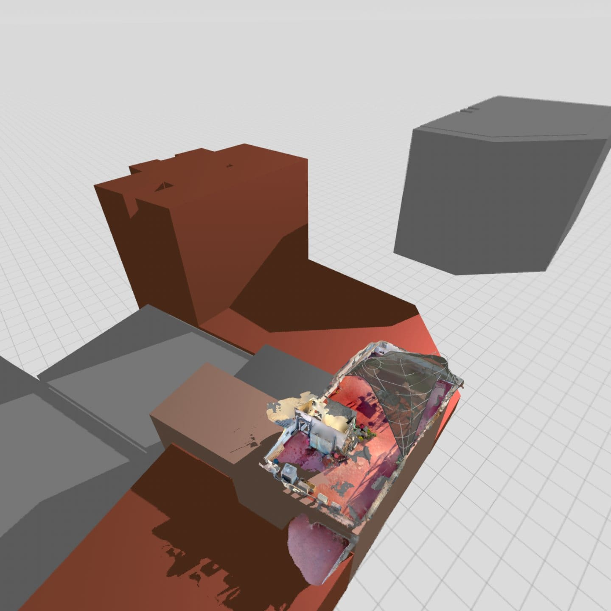
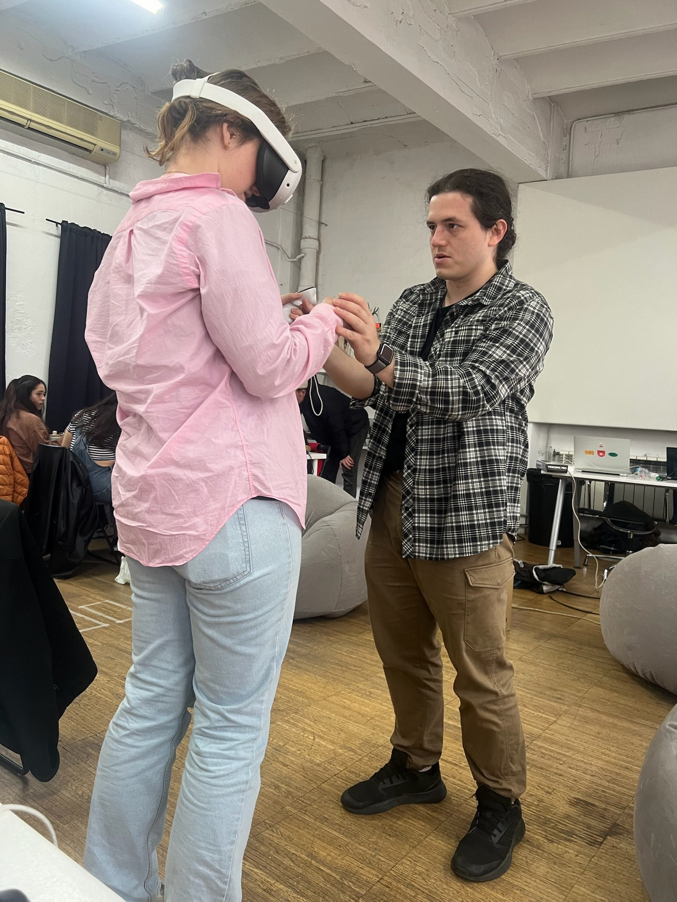
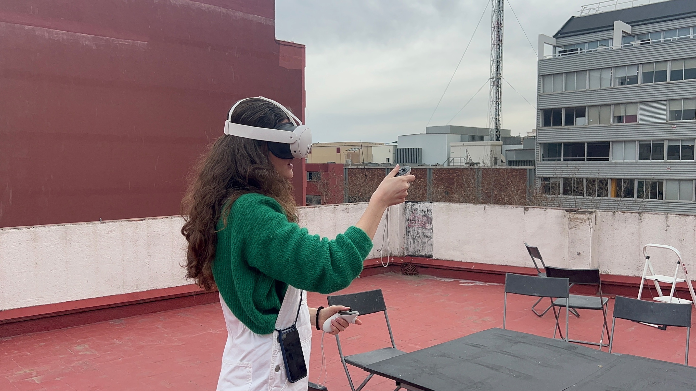
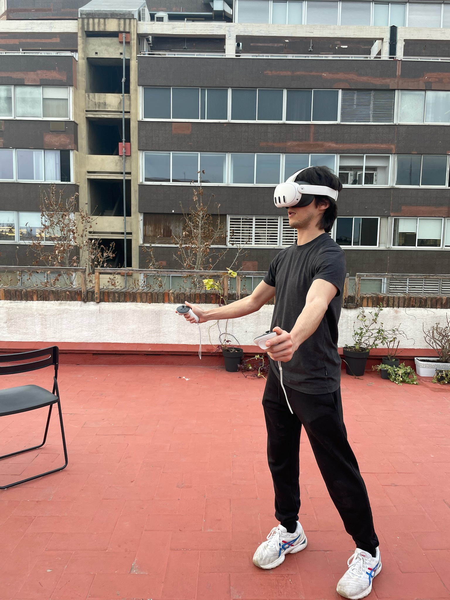
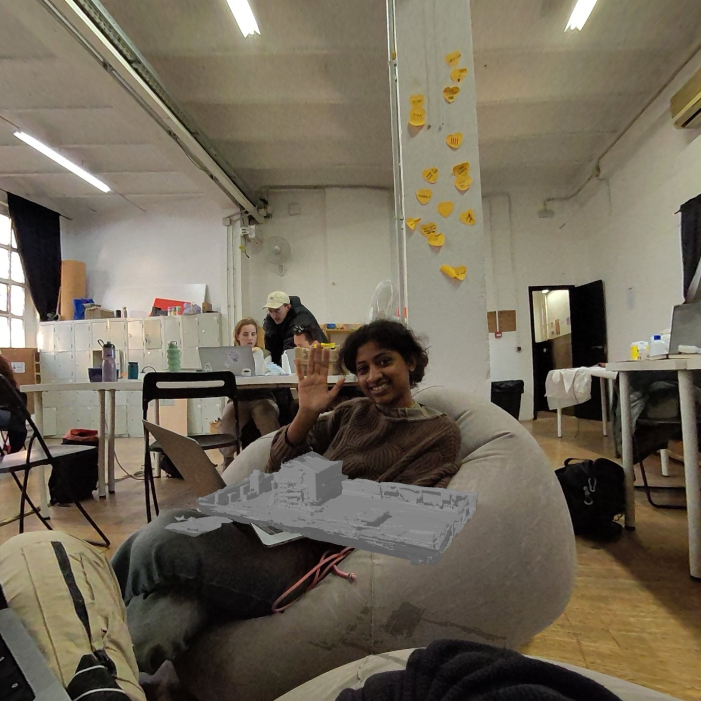
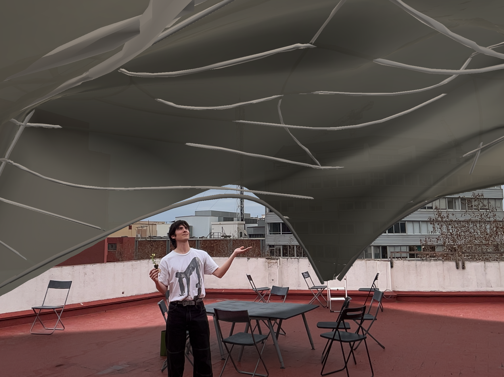
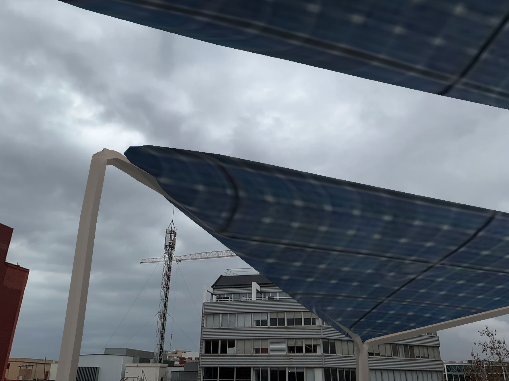
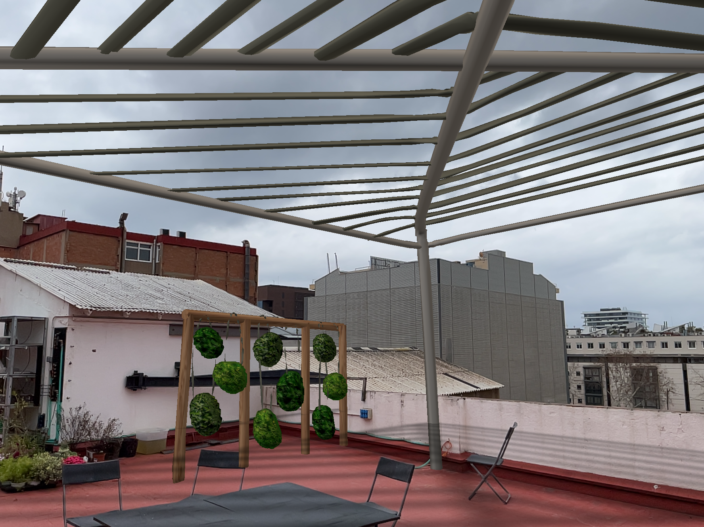
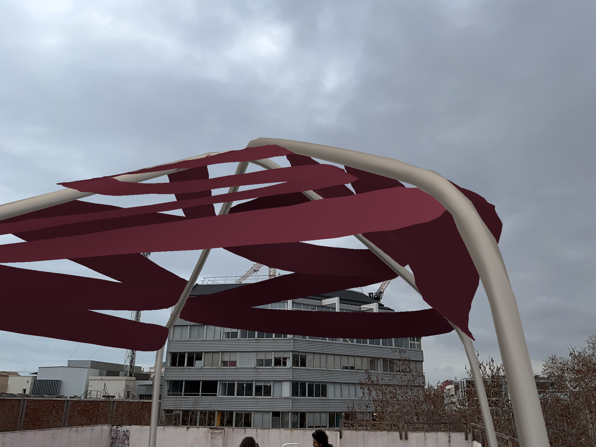
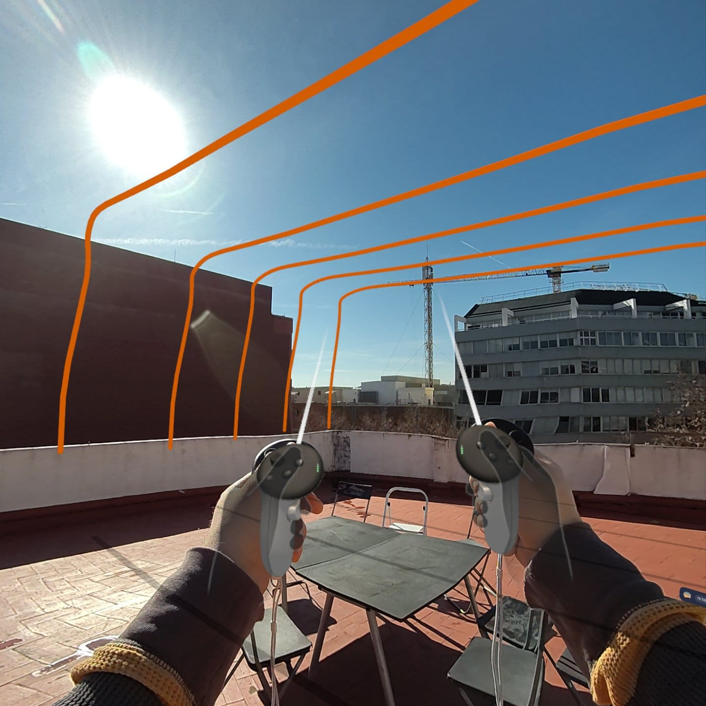

---
hide:
    - toc
---

Complete project repo and story:

https://github.com/DhrishyaRamadass/Microchallenge1

Voting site:

https://linktr.ee/roofiaac

# **Microchallenge- Collaborative Design Participation with Immersive Tech**
### *Dhrishya Ramadass and Jorge DLM*

## Reflection

Reflecting on the "Microchallenge- Collaborative Design Participation with Immersive Tech" project, I find myself deeply engrossed in the implications of what we've accomplished and what it signifies for the future of collaborative design processes. This project, although a small-scale MVP, encapsulates the profound potential of integrating immersive technology with community engagement in design processes. It's a tangible demonstration of how we can democratize design, making it accessible and engaging for all members of a community, not just professionals.

### Empowerment through Immersive Technology

The project's objective was clear from the start: to empower community members to actively participate in the design process of our communal spaces. By utilizing immersive technology, we've not only opened up the design process but have also provided a platform for community voices to be heard and visualized in real-time. This approach transforms the traditional, often exclusive, design process into an inclusive, collaborative experience, where the community's collective intelligence shapes our shared spaces.

### Facilitating User-centric Design Iterations

The use of a 3D scanner to capture the spatial dimensions of the roof area was a crucial first step, laying the groundwork for what was to become a series of inclusive design iterations. By importing these scans into Gravity Sketch and integrating feedback from community members through Procreate and Adobe Aero, we've showcased a seamless blend of technology and human insight. This iterative process, supported by AR technology, not only enhances the design quality but also ensures that the final output resonates with the users' needs and preferences.

### The Role of AR in Collaborative Design

The integration of AR technology through Adobe Aero presented a groundbreaking opportunity to visualize proposed designs within the actual physical space. This aspect of our project underscores the potential of AR in making design processes more interactive and tangible. The ability to scan a QR code and immediately see the potential transformations of a space bridges the gap between abstract ideas and concrete realities, making civic participation not just productive but also delightful.

#### Reflections on Civic Engagement and Participation

This project stands as a testament to the evolving landscape of civic engagement in design processes. The enthusiastic participation of our fellow students, their willingness to engage with new technologies, and the collective creativity unleashed during this project are indicative of a broader shift towards more open, collaborative design methodologies. By facilitating an environment where civic engagement and participation are not only easier but also more productive, we're stepping into a future where design processes are inherently more democratic and inclusive.

### Looking Forward

As we look forward to expanding on this MVP, the possibilities for more complex, co-created projects are endless. The integration of AI in the development of these projects can further streamline the collaborative process, making it more efficient and effective. This project has laid the groundwork for a new era of design, where technology empowers communities to actively shape their environments, creating spaces that are not only functional but also deeply reflective of the community's identity and values.

### "How Might We?" Questions Moving Forward

As we venture into the second part of the microchallenge, several "How Might We?" questions emerge to guide our exploration and ensure the continuation of this innovative approach to design:

- How might we leverage collaborative play to make the design process more engaging and foster a deeper sense of community ownership?

- How might we facilitate asynchronous co-creation, allowing participants to contribute to projects on their own schedule, while still maintaining a cohesive design vision?

- How might we use immersive tech to visualize the potential impacts of design choices on the environment and community well-being in real-time?

- How might we build on the insights from this microchallenge to create a scalable model for collaborative urban development projects worldwide?

- How might we incorporate feedback mechanisms into the AR experience, enabling a dynamic and iterative design process that evolves based on community input?

- How might we design intuitive platforms that enable people of varying skill levels to express their ideas both verbally and visually, ensuring that technical jargon doesn’t hinder their participation?

- How might we create engaging and accessible entry points for individuals who are aware of urban problems and motivated to contribute, overcoming the barrier of feeling powerless against systemic issues?

- How might we craft compelling narratives that transform apathy into action for those who know about urban problems but choose not to engage, showing them the direct impact their involvement could have?

This project, while a small-scale MVP, sets the stage for a broader dialogue on the future of collaborative design. It challenges us to reimagine the possibilities of civic engagement, making the process of shaping our urban environments more inclusive, democratic, and creative than ever before.

