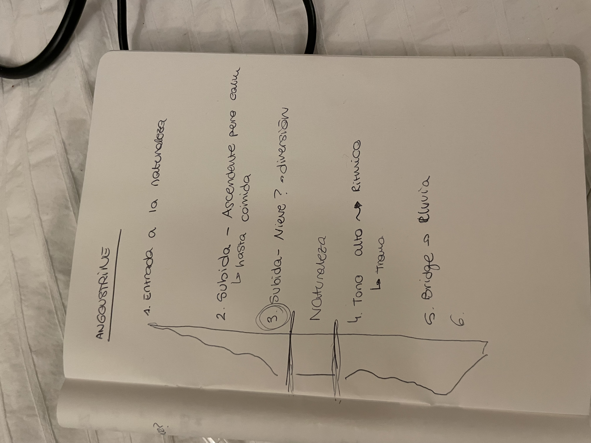

---
hide:
    - toc
---

<iframe width="560" height="315" src="https://www.youtube.com/embed/c1HUqCjW-n0?si=GlNF1war_dHVHQ7n" title="YouTube video player" frameborder="0" allow="accelerometer; autoplay; clipboard-write; encrypted-media; gyroscope; picture-in-picture; web-share" referrerpolicy="strict-origin-when-cross-origin" allowfullscreen></iframe>

(Better with headphones!)

# Angoustrine Des les Escaldes

Reflecting on our research trip to Angoustrine, it stands out as a distinct blend of personal exploration and collaborative creation. While many of our classmates engaged directly with the tactile and visual elements of the landscape, Carmen Robres and I chose to channel our experiences through an auditory lens, translating the essence of Angoustrine into music.

## A Different Mode of Expression

The decision to reinterpret our first-person perspective experiences into a musical composition stemmed from a desire to explore a non-visual medium that could equally capture the profound impact of our surroundings. This approach allowed us to delve deeper into the emotional and sensorial facets of our journey, particularly during our extensive hike through the varied landscapes of the Angoustrine Valley.

## Collaboration and Inspiration

Working closely with Carmen in the library at the beautiful Grande Maison Rouge, our partnership was instrumental in shaping the final outcome. Our collaboration was not just about creating music but about sharing perceptions and feelings, which enriched the creative process. The song I composed was deeply influenced by the collective experiences shared with classmates and the natural ambiance that enveloped us.

## Integrating Nature's Symphony

A pivotal element of our project was incorporating live nature sounds into the composition. The birdsongs we recorded didn't just serve as a backdrop but actively influenced the musical elements, such as the guitar's tuning and the song’s harmonic progression. This method did more than embed authentic natural sounds into our work; it allowed the environment itself to dictate part of the musical structure, reflecting the organic flow of our experiences.

## Musical Reflections of a Journey

The song is, in essence, a reflection of the emotions and transitions we experienced as a group. From the serene to the stirring moments, the music mirrors the dynamic landscapes of Angoustrine Valley. The use of birdsongs and natural sounds aims to evoke the same sense of wonder and connection to nature that we felt during our hike.

## Conclusion

This unique project was a journey in itself, one that challenged us to translate a multisensory experience into a different creative realm. The final delivery, a song composed amidst and inspired by the valley, stands as a testament to the power of interdisciplinary approaches to capturing and conveying environmental experiences. It was a reminder of the universal language of music and its capability to encapsulate and communicate complex landscapes of emotion and place. This venture not only enriched my understanding of environmental interaction but also highlighted the potential for creative collaboration to amplify and diversify our expressions of the world around us.

(Song re-recorded at home with proper equipment)

