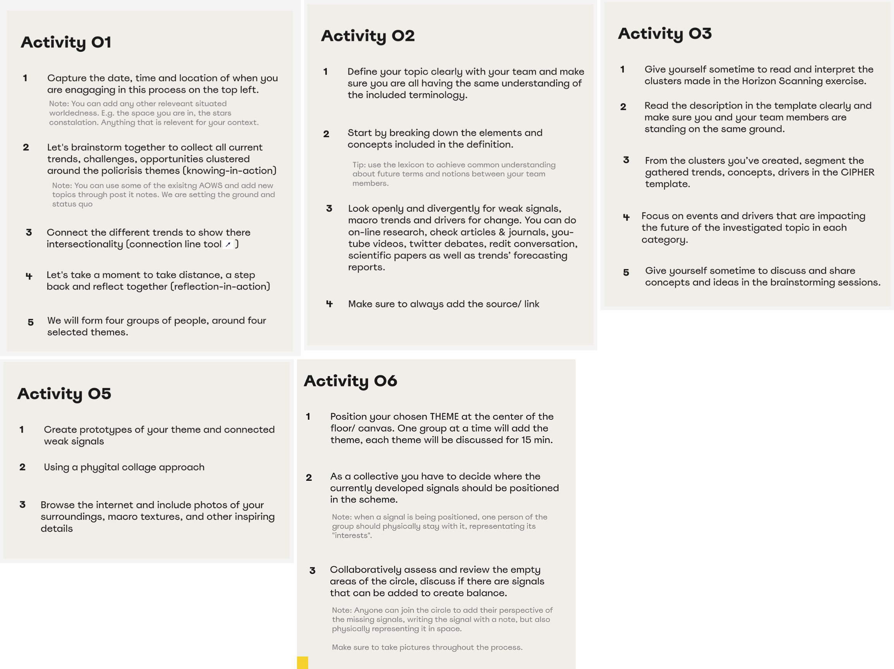
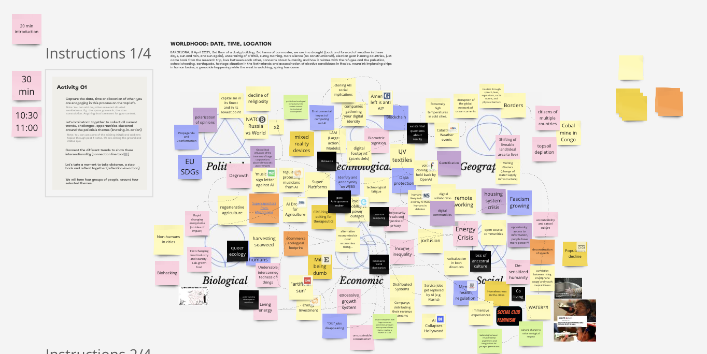
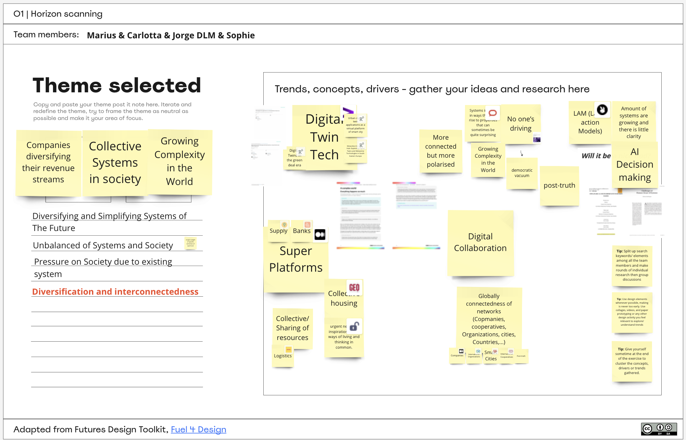
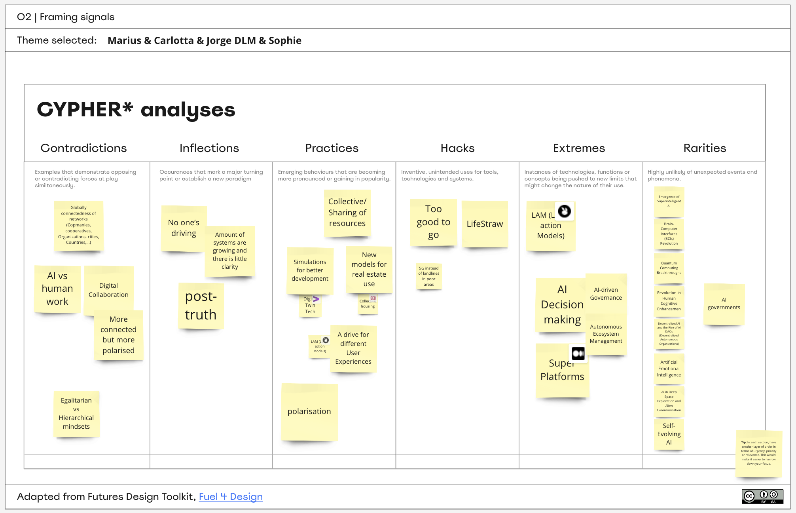
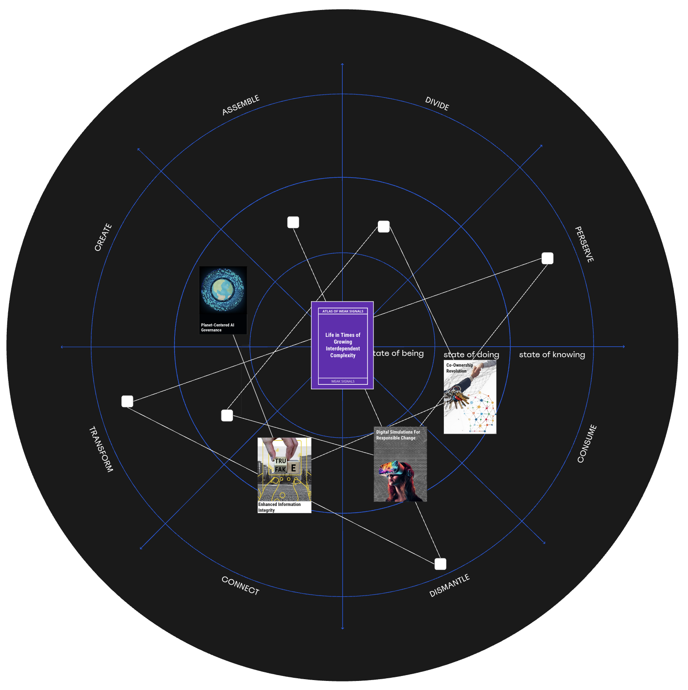
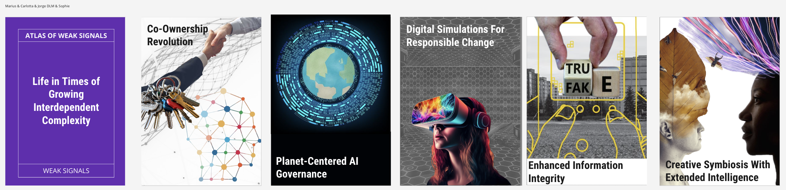

---
hide:
    - toc
---

# Creating new AOWS cards

The workshop led by Olga Trevisan and Jessica Guy was a solid, hands-on session. Working with Marius, Sophie, and Carlotta, we dove straight into dissecting and expanding the Atlas of Weak Signals (AOWS). The process was practical and insightful, guiding us to create new weak signal cards that dove deeper than just scratching the surface. It was an effective brainstorming session that brought to light some compelling ideas, and it reinforced my dedication to the AOWS project.

Our group tackled signals that neatly aligned with the original set, covering topics like Digital Twin technology, Large Action Models, AI in decision-making, global polarization, and the rise of new all-encompassing platforms. Our final output—cards like Co-Ownership Revolution and Planet-Centered AI Governance—really captured the essence of today's intertwined complexities.

While my original reservations about the way the AOWS include the other foresight tools( we're missing strong signals, drivers of change, critical uncertainties, scenarios), I think the freshness rating we’re introducing might just be the right kind of filter we need. It could help us in a second run to hone these cards to focus more sharply on the change drivers without leaning towards any particular type of future.

The workshop's steps were well laid out, from jotting down our contextual data in Activity 01 to defining and breaking down our topics in Activity 02. When we reached Activity 03, piecing together the clusters into the CIPHER template, we got a clear picture of the different impacts on our theme's future. The prototyping in Activity 05 allowed us to get creative and tactile with our ideas. And finally, positioning our themes within the physical space in Activity 06 was an engaging way to wrap up our session.

This workshop validated a critical point for me: the AOWS can draw from various techniques for content generation. However, its true strength lies in the collaborative process—a collective effort that brings diverse perspectives into a unified, actionable format. Moving forward, I see the freshness rating as a key step that could keep our content fresh and unbiased, focusing on driving forces without nudging us towards any single future scenario.

