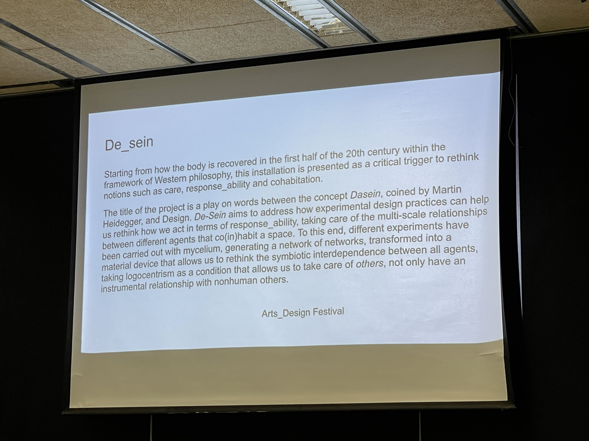

---
hide:
    - toc
---

### Communicating Ideas Through Narrative

Reflecting on Laura Benitez's insights on narrative and storytelling, I've come to appreciate how narratives are not just stories with a beginning, middle, and end. Instead, they are complex structures composed of multiple voices and perspectives, much like the interventions we design. As a designer and futurist, this approach to narrative deeply resonates with my practice of crafting interventions that aim to convey complex ideas and foster understanding among diverse audiences.

### The Power of Narrative

Narrative, as Jerome Bruner suggests, is a powerful epistemic tool. It imposes meaning on the world, shaping how we understand and explain our experiences. This is particularly relevant in our current era, often described as the post-truth era, where narratives are used to create conceptions that might not always be based on certainty or rigorousness. Understanding this dynamic is crucial for us as designers because it emphasizes the responsibility we hold in shaping narratives that are truthful and impactful.

### Staying with the Narrative

Walter Benjamin, in his essay "The Storyteller," highlights the importance of allowing a story to speak for itself without forcing a psychological connection on the reader. This concept of leaving room for interpretation is vital in designing interventions. It allows the audience to engage with the narrative personally and draw their own meanings, thus achieving a depth that mere information cannot.

### De_Sein: An Example of Narrative in Design

The "De_Sein" installation is a profound example of using narrative to explore philosophical concepts. This project addresses Heidegger's concept of Dasein, focusing on the unique existential condition of humans and their capacity for reflection and care. By incorporating mycelium experiments, the installation creates a tangible network that symbolizes the symbiotic interdependence between different agents, both human and non-human. This approach not only makes the abstract concept of Dasein accessible but also invites the audience to rethink their relationships with others and their environment.

### Practical Application in Festival Storytelling

In preparing for a festival, thinking of interventions as storytelling actions becomes essential. Each intervention can be seen as a narrative composed of multiple voices, each contributing to the overall story. For instance, a project might include elements such as interactive installations, multimedia presentations, and live performances, each adding a unique thread to the narrative. This multi-voiced approach ensures that the narrative is rich, dynamic, and engaging, allowing the audience to explore different perspectives and interpretations.

### Description of My Intervention for the Festival

For the upcoming festival, I am planning an installation titled "Echoes of the Future." This intervention will explore the interconnectedness of past, present, and future through a multi-sensory experience. The installation will feature:

1. **Interactive Projections:** Historical images and futuristic scenarios projected onto walls, allowing visitors to interact with and manipulate the visuals, thus experiencing the fluidity of time.
2. **Soundscapes:** A blend of archival recordings and speculative future sounds will create an immersive auditory experience, emphasizing the continuous thread of human experience.
3. **Narrative Stations:** Small booths where visitors can listen to or read stories from different time periods, narrated by diverse voices. These stations will include personal anecdotes, scientific predictions, and philosophical reflections, highlighting the multiplicity of narratives that shape our understanding of time.
4. **Collaborative Mural:** A large, evolving mural where visitors can contribute their visions of the future, creating a collective narrative that grows throughout the festival.

### Conclusion

This approach to narrative and storytelling in design interventions aligns closely with the insights from our class and my journey as a designer and futurist. By considering interventions as multi-voiced narratives, we can create richer, more engaging experiences that invite audiences to explore, interpret, and connect with the ideas presented. This not only enhances the impact of our work but also fosters a deeper understanding and appreciation of the complex world we inhabit.