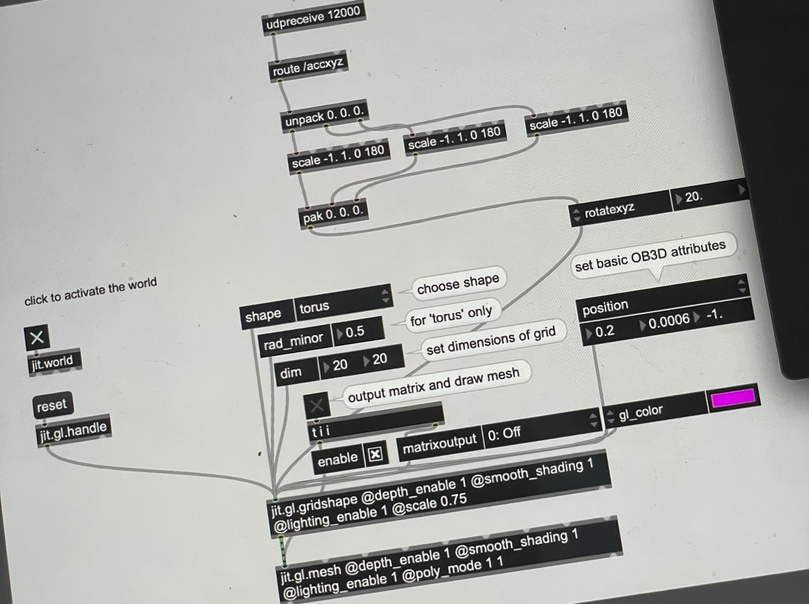
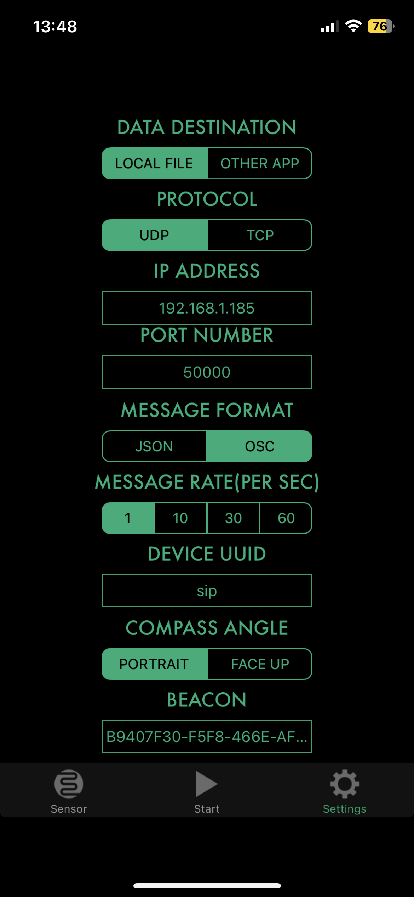

---
hide:
    - toc
---

In Module 4 of our digital prototyping class, we delved into the basics of machine learning programs, creating datasets, and training machine learning algorithms using Wekinator. Our goal was to connect these algorithms to physical sensors to produce meaningful outputs based on the data received. This exploration provided a fascinating insight into the intersection of sensor technology and machine learning, offering a unique challenge and a break from my usual thesis work.

##### Facts:

In this module, we were tasked with creating a soft sensor capable of detecting pressure changes. The sensor was made using conductive fabric, felt, and conductive tape. The data from the sensor was then sent to Wekinator for training, where we categorized the pressure levels. Once trained, we connected the data to Max/MSP to visualize the pressure changes via a neopixel LED mounted on a Barduino board. The LED color shifted from green to red as the pressure increased, providing a clear visual representation of the sensor's functionality.

##### Feelings:

This module was both challenging and enlightening. I felt a mix of excitement and frustration as we worked to calibrate the sensor and train the model. The moment when we successfully visualized the pressure data through the neopixel LED was particularly rewarding. The process of integrating the sensor with the machine learning model and seeing tangible results was a testament to the power of combining physical and digital technologies.

##### Findings:
Through this module, I learned the importance of precise calibration and iterative testing in developing functional prototypes. The hands-on experience with Wekinator and Max/MSP was invaluable, highlighting the potential of machine learning in processing sensor data. Additionally, the project underscored the significance of diverse datasets for accurate and reliable machine learning models.

##### Future:

Looking ahead, I plan to apply the lessons learned from this project to future explorations in sensor technology and machine learning. Ensuring robust data collection and precise calibration will be key priorities. I am excited to explore more complex sensor configurations and data models, leveraging the skills gained to create innovative and interactive systems.

### Reflection Summary
This module was a valuable exercise in integrating sensor technology with machine learning to create interactive outputs. It reinforced the importance of iterative design, careful calibration, and the potential of flexible sensors in various applications. The experience was both educational and inspiring, opening new avenues for future projects.

